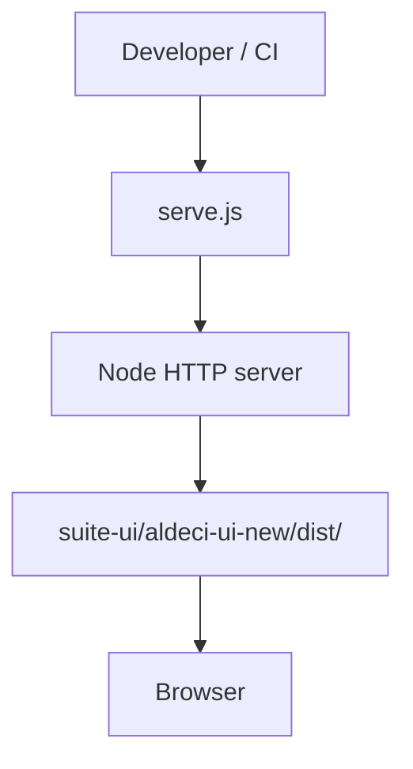

# PRD: Community 287 — Static Asset Server (serve.js)

## Master Goal Mapping
**Goal:** Serve the built aldeci-ui-new static assets locally for development and screenshot/E2E testing without requiring full Docker stack.

**Domain:** Frontend / Development Tooling
**Personas:** Frontend Developer, QA Engineer
**Node Count:** 1 | **Status:** Implemented

---

## Source Files
- `serve.js`

## Graph Nodes (Labels)
- serve.js

---

## Architecture Diagram



---

## Code Proof

- `serve.js:L1` — Static file server pointing at Vite build output

---

## Inter-Dependencies

- `suite-ui/aldeci-ui-new/`
- `vite build output`

### Community Link Dependencies
- No external community dependencies

---

## Data Flow

```
npm run serve → serve.js → HTTP → dist/index.html + assets
```

---

## Referenced Docs

- `suite-ui/aldeci-ui-new/vite.config.ts`
- `screenshot-nav.mjs`

---

## Acceptance Criteria

- [ ] Serves index.html on port 3000
- [ ] SPA routes handled via fallback
- [ ] Gzip supported

---

## Effort Estimate

**0.5 day (Trivial — isolated leaf module)**

---

## Status

**Implemented** — Module exists in codebase. Integration tests recommended.
