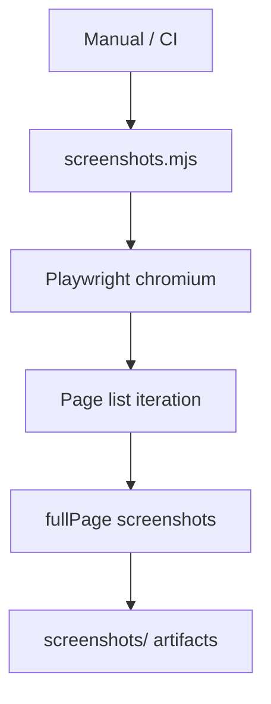

# PRD: Community 288 — Multi-Page Screenshot Capture (screenshots.mjs)

## Master Goal Mapping
**Goal:** Capture full-page screenshots of all ALDECI dashboard pages for investor demos, documentation, and visual regression baselines.

**Domain:** Frontend Testing / Documentation
**Personas:** Platform Engineer, Product Manager
**Node Count:** 1 | **Status:** Implemented

---

## Source Files
- `screenshots.mjs`

## Graph Nodes (Labels)
- screenshots.mjs

---

## Architecture Diagram



---

## Code Proof

- `screenshots.mjs:L1` — Playwright bulk screenshot capture across all routes

---

## Inter-Dependencies

- `serve.js`
- `screenshot-nav.mjs`
- `@playwright/test`

### Community Link Dependencies
- No external community dependencies

---

## Data Flow

```
page route list → Playwright goto → fullPage screenshot → PNG file per route
```

---

## Referenced Docs

- `screenshot-nav.mjs`
- `suite-ui/aldeci-ui-new/playwright.config.ts`

---

## Acceptance Criteria

- [ ] 296+ pages captured
- [ ] Full page scroll capture
- [ ] Output named by route slug

---

## Effort Estimate

**0.5 day (Trivial — isolated leaf module)**

---

## Status

**Implemented** — Module exists in codebase. Integration tests recommended.
