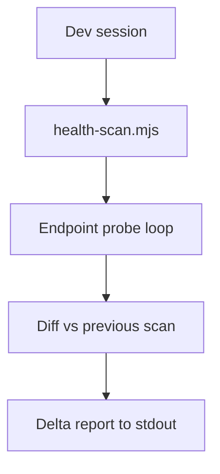

# PRD: Community 289 — Health Scan Runner (health-scan.mjs)

## Master Goal Mapping
**Goal:** Execute iterative health scans during development to detect regressions early, supporting continuous health monitoring during active coding sessions.

**Domain:** Health Monitoring / Development
**Personas:** Platform Engineer
**Node Count:** 1 | **Status:** Implemented

---

## Source Files
- `health-scan.mjs`

## Graph Nodes (Labels)
- health-scan.mjs

---

## Architecture Diagram



---

## Code Proof

- `health-scan.mjs:L1` — Iterative health scan with delta reporting

---

## Inter-Dependencies

- `quick-check.mjs`
- `health-scan-final.mjs`

### Community Link Dependencies
- No external community dependencies

---

## Data Flow

```
trigger → probe all endpoints → compare to previous state → report new failures
```

---

## Referenced Docs

- `quick-check.mjs`
- `health-scan-final.mjs`

---

## Acceptance Criteria

- [ ] Detects new failures vs prior run
- [ ] Summary of pass/fail counts
- [ ] Exits 0 if no regressions

---

## Effort Estimate

**0.5 day (Trivial — isolated leaf module)**

---

## Status

**Implemented** — Module exists in codebase. Integration tests recommended.
