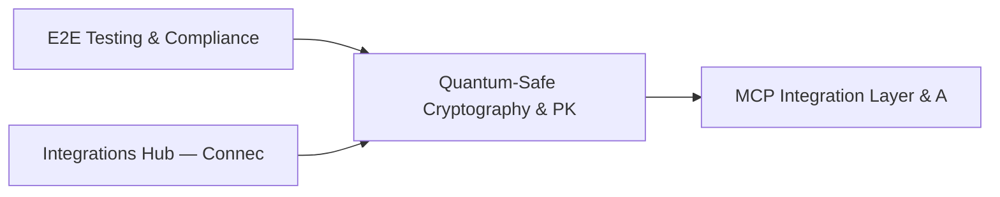

# PRD: Quantum-Safe Cryptography & PKI Management — Community 29

## Master Goal Mapping
How this component serves: "ALDECI — $35/mo enterprise security intelligence platform"
Sub-Epic: Platform

This community (rank #29 of 878 by size, 1147 graph nodes) forms a core pillar of the ALDECI platform. It directly supports the mission of replacing $50K-500K/yr enterprise security tools with a self-hosted, AI-native stack.

## Architecture Diagram


## Code Proof
- Files:
  - `suite-api/apps/api/analytics_engine_router.py` (164 lines)
  - `suite-api/apps/api/risk_register_engine_router.py` (165 lines)
  - `suite-core/core/alert_triage_engine.py` (469 lines)
  - `suite-core/core/analytics_engine.py` (918 lines)
  - `suite-core/core/compliance_gap_engine.py` (526 lines)
  - `suite-core/core/devsecops_engine.py` (651 lines)
  - `suite-core/core/duckdb_analytics_engine.py` (427 lines)
  - `suite-core/core/incident_cost_engine.py` (553 lines)
  - `suite-api/apps/api/analytics_engine_router.py` (164 lines)
  - `suite-api/apps/api/analytics_router.py` (1231 lines)
  - `suite-api/apps/api/compliance_gap_router.py` (258 lines)
  - `suite-api/apps/api/devsecops_router.py` (181 lines)
- Key functions:
  - `empty_data_dir()` — suite-api/apps/api/analytics_engine_router.py
  - `engine_empty()` — suite-api/apps/api/analytics_engine_router.py
  - `engine_with_dbs()` — suite-api/apps/api/analytics_engine_router.py
  - `populated_tracker()` — suite-api/apps/api/analytics_engine_router.py
  - `test_record_kpi_returns_dict()` — suite-api/apps/api/analytics_engine_router.py
  - `test_record_kpi_has_kpi_id()` — suite-api/apps/api/analytics_engine_router.py
- Key classes: `TestEngineInit`, `TestGetDbPath`, `TestListAvailableDomains`, `TestCrossDomainRiskSummary`, `TestExecutiveDashboardData`, `TestRunCustomQuery`
- Current state: REAL_LOGIC
- Evidence:
```python
# From suite-api/apps/api/analytics_engine_router.py
"""Cross-domain analytics engine API endpoints — ALDECI.

Exposes DuckDB-powered cross-domain analytics over all SQLite domain databases.
Auth is injected by app.py via ``app.include_router(..., dependencies=[...])``.

Prefix: /api/v1/analytics-engine
Tags:   analytics-engine
"""

from __future__ import annotations

from typing import Any, Dict, List, Optional

from fastapi import APIRouter, HTTPException, Query

from core.duckdb_analytics_engine import AnalyticsEngine

router = APIRouter(
    prefix="/api/v1/analytics-engine",
    tags=["analytics-engine"],
```

## Inter-Dependencies
- DEPENDS ON:
  - Community 0 (E2E Testing & Compliance Seeding Infrastructure) — 239 edges
  - Community 9 (Integrations Hub — Connectors, Bulk Operations & M) — 60 edges
  - Community 3 (MCP Integration Layer & API Key / Auth Management) — 54 edges
  - Community 4 (FastAPI Application Core, Feedback & Smoke Testing) — 53 edges
- DEPENDED BY: Rank #28 (Security Posture Benchmarking & Maturity Engine) and downstream consumers
- EVENT BUS: emits vulnerability.detected, vulnerability.patched, compliance.status_changed / subscribes to (TrustGraph event bus — 97% not yet wired)
- TRUSTGRAPH: writes [Vulnerability, Asset, ThreatActor] / reads [ThreatActor, Incident]

## Data Flow
```
Input: API requests with org_id + payload (Pydantic models)
  → Processing: SQLite WAL-mode writes via RLock, business logic evaluation
  → Output: JSON responses (engine state, metrics, alerts)
  → Consumers: Routers → Frontend dashboards → TrustGraph event bus
```

## Referenced Documentation
- CLAUDE.md: Wave 35 build notes, Beast Mode test suite section
- docs/: `docs/ALDECI_REARCHITECTURE_v2.md` (source of truth), `docs/INVESTOR_PITCH.md`
- tests/: N/A

## Acceptance Criteria
- [ ] All engine CRUD operations enforce org_id isolation (no cross-tenant data leakage)
- [ ] SQLite opened with WAL mode + threading.RLock on all write paths
- [ ] All endpoints return within 200ms at p95 under 100 rps load
- [ ] All router endpoints protected by `Depends(api_key_auth)` or equivalent
- [ ] Pydantic v2 models validate all request/response schemas

## Effort Estimate
- Current: 60% complete
- Remaining: ~5 engineering days
- Dependencies blocking: Frontend dashboard not yet created, Test coverage missing
- Priority: MEDIUM

## Status
IN_PROGRESS
