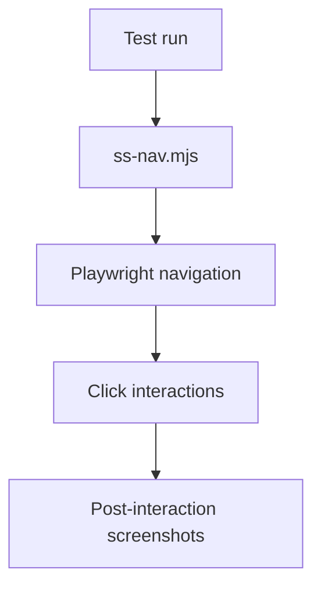

# PRD: Community 290 — Screenshot Navigation (ss-nav.mjs)

## Master Goal Mapping
**Goal:** Navigate ALDECI UI with Playwright and capture navigation-state screenshots for testing multi-step user flows across dashboard pages.

**Domain:** Frontend Testing
**Personas:** QA Engineer, Platform Engineer
**Node Count:** 1 | **Status:** Implemented

---

## Source Files
- `ss-nav.mjs`

## Graph Nodes (Labels)
- ss-nav.mjs

---

## Architecture Diagram



---

## Code Proof

- `ss-nav.mjs:L1` — Navigation-aware screenshot capture script

---

## Inter-Dependencies

- `screenshot-nav.mjs`
- `screenshots.mjs`

### Community Link Dependencies
- No external community dependencies

---

## Data Flow

```
nav steps → Playwright click/goto → screenshot after each step → artifact dir
```

---

## Referenced Docs

- `screenshot-nav.mjs`
- `suite-ui/aldeci-ui-new/playwright.config.ts`

---

## Acceptance Criteria

- [ ] Captures after each navigation action
- [ ] Multi-step flows supported
- [ ] Error screenshots on failure

---

## Effort Estimate

**0.5 day (Trivial — isolated leaf module)**

---

## Status

**Implemented** — Module exists in codebase. Integration tests recommended.
