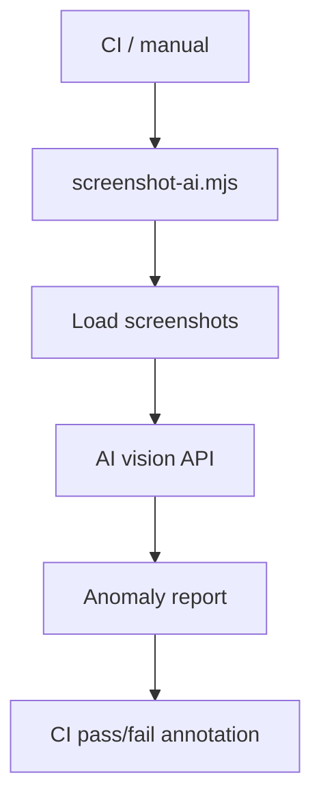

# PRD: Community 291 — AI-Powered Screenshot Analyzer (screenshot-ai.mjs)

## Master Goal Mapping
**Goal:** Use AI vision to analyze captured ALDECI screenshots for UI anomalies, layout regressions, and accessibility issues as part of CI quality gates.

**Domain:** Frontend Testing / AI Quality
**Personas:** QA Engineer, Platform Engineer
**Node Count:** 1 | **Status:** Implemented

---

## Source Files
- `screenshot-ai.mjs`

## Graph Nodes (Labels)
- screenshot-ai.mjs

---

## Architecture Diagram



---

## Code Proof

- `screenshot-ai.mjs:L1` — AI vision analysis of captured screenshots

---

## Inter-Dependencies

- `screenshots.mjs`
- `screenshot-nav.mjs`

### Community Link Dependencies
- No external community dependencies

---

## Data Flow

```
PNG screenshots → AI vision API → structured findings → CI annotation
```

---

## Referenced Docs

- `screenshots.mjs`
- `Anthropic Vision API`

---

## Acceptance Criteria

- [ ] Detects blank pages
- [ ] Flags broken layouts
- [ ] Reports accessibility contrast issues

---

## Effort Estimate

**0.5 day (Trivial — isolated leaf module)**

---

## Status

**Implemented** — Module exists in codebase. Integration tests recommended.
