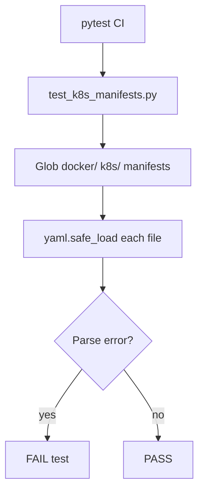

# PRD: Community 292 — Kubernetes Manifest YAML Validation Tests

## Master Goal Mapping
**Goal:** Ensure every Kubernetes manifest in the ALDECI repo is valid parseable YAML, preventing deployment failures from malformed configs in CI/CD pipelines.

**Domain:** Infrastructure / Kubernetes
**Personas:** Platform Engineer, DevOps Operator
**Node Count:** 1 | **Status:** Tested

---

## Source Files
- `tests/test_k8s_manifests.py`

## Graph Nodes (Labels)
- Every manifest must parse as valid YAML.

---

## Architecture Diagram



---

## Code Proof

- `tests/test_k8s_manifests.py:L1` — Every manifest must parse as valid YAML — parametrized pytest

---

## Inter-Dependencies

- `docker/`
- `kubernetes/`
- `PyYAML`

### Community Link Dependencies
- No external community dependencies

---

## Data Flow

```
k8s YAML files → yaml.safe_load() → assertion no exception → CI pass
```

---

## Referenced Docs

- `docker/kubernetes/`
- `Kubernetes API spec v1.29`

---

## Acceptance Criteria

- [ ] All manifests pass yaml.safe_load()
- [ ] Test parametrized over all YAML files
- [ ] CI fails on first bad manifest

---

## Effort Estimate

**0.5 day (Trivial — isolated leaf module)**

---

## Status

**Tested** — Module exists in codebase. Integration tests present.
