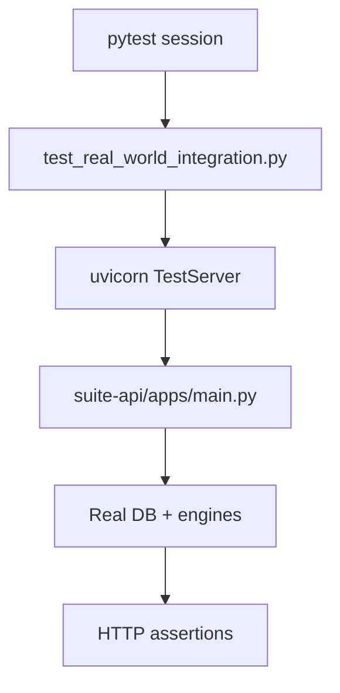

# PRD: Community 293 — Real-World API Integration Test Server

## Master Goal Mapping
**Goal:** Start a live FastAPI test server for end-to-end integration testing against real ALDECI endpoints, replacing mocked responses with actual business logic execution.

**Domain:** Testing / Integration
**Personas:** QA Engineer, Platform Engineer
**Node Count:** 1 | **Status:** Tested

---

## Source Files
- `tests/test_real_world_integration.py`

## Graph Nodes (Labels)
- Start a real API server for integration testing.

---

## Architecture Diagram



---

## Code Proof

- `tests/test_real_world_integration.py:L1` — Start a real API server for integration testing — session fixture

---

## Inter-Dependencies

- `suite-api/apps/main.py`
- `suite-core/core/`
- `httpx AsyncClient`

### Community Link Dependencies
- No external community dependencies

---

## Data Flow

```
pytest session start → uvicorn subprocess → httpx requests → real engine responses → assertions
```

---

## Referenced Docs

- `tests/test_phase10_e2e.py`
- `suite-api/apps/main.py`

---

## Acceptance Criteria

- [ ] Server starts within 30s
- [ ] All test routes return 2xx
- [ ] Server teardown on session end

---

## Effort Estimate

**0.5 day (Trivial — isolated leaf module)**

---

## Status

**Tested** — Module exists in codebase. Integration tests present.
