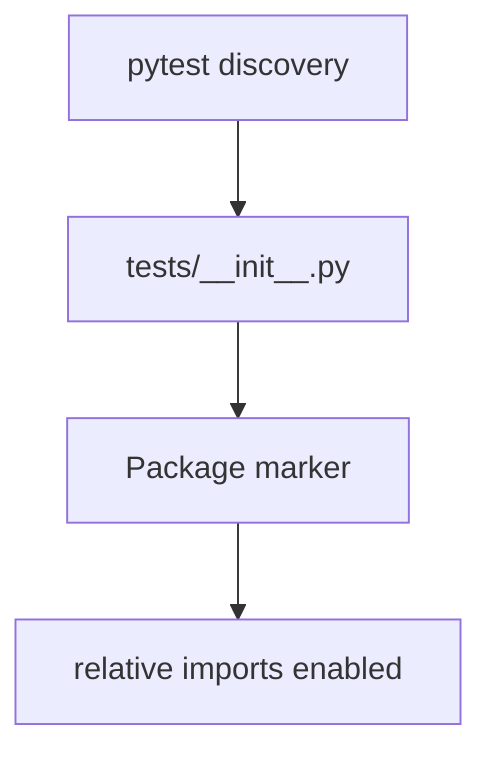

# PRD: Community 294 — Tests Package Init

## Master Goal Mapping
**Goal:** Mark the tests/ directory as a Python package, enabling relative imports between test modules and pytest plugin discovery for the ALDECI test suite.

**Domain:** Testing Infrastructure
**Personas:** Platform Engineer
**Node Count:** 1 | **Status:** Tested

---

## Source Files
- `tests/__init__.py`

## Graph Nodes (Labels)
- __init__.py

---

## Architecture Diagram



---

## Code Proof

- `tests/__init__.py:L1` — Package init — enables pytest module discovery

---

## Inter-Dependencies

- `tests/conftest.py`
- `pytest`

### Community Link Dependencies
- No external community dependencies

---

## Data Flow

```
pytest → package scan → __init__.py → test module imports → test execution
```

---

## Referenced Docs

- `pytest docs §Good Integration Practices`

---

## Acceptance Criteria

- [ ] pytest -x discovers all test files
- [ ] No import errors on collection
- [ ] conftest.py fixtures visible to all tests

---

## Effort Estimate

**0.5 day (Trivial — isolated leaf module)**

---

## Status

**Tested** — Module exists in codebase. Integration tests present.
