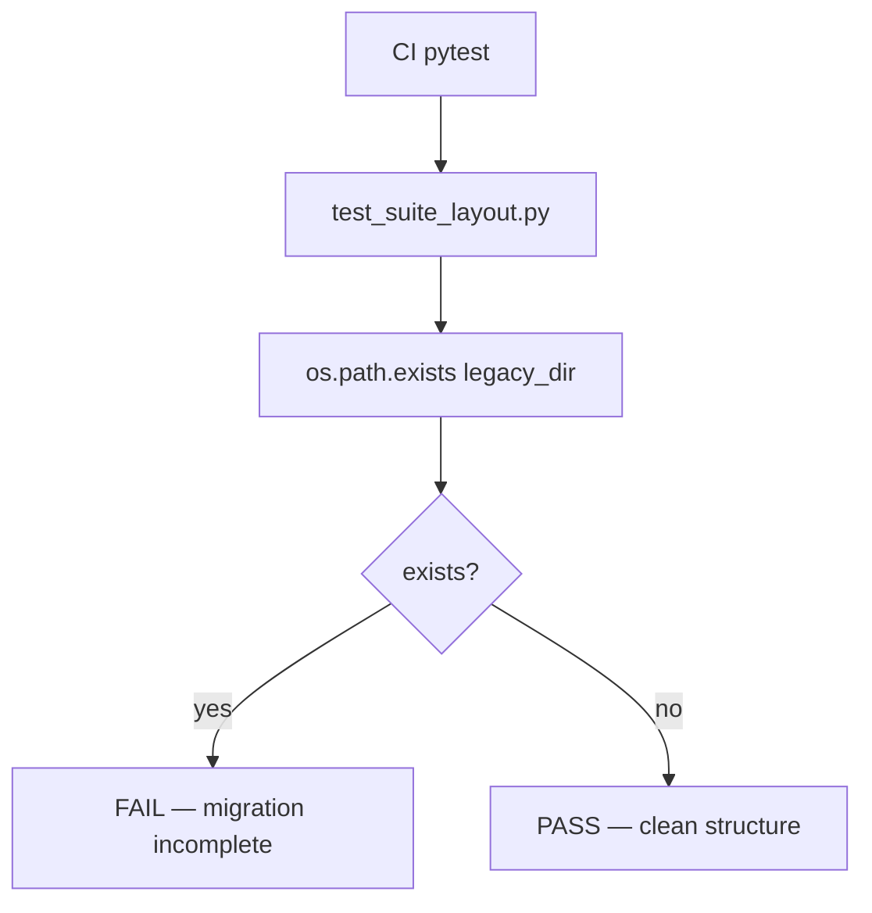

# PRD: Community 295 — Suite Layout Validation — Legacy Dir Absent

## Master Goal Mapping
**Goal:** Assert the legacy monolithic code directory no longer exists at the repo root, enforcing the ALDECI v2 suite-based directory structure migration.

**Domain:** Architecture / Repository Governance
**Personas:** Platform Engineer
**Node Count:** 1 | **Status:** Tested

---

## Source Files
- `tests/test_suite_layout.py`

## Graph Nodes (Labels)
- Legacy code directory should not exist at root.

---

## Architecture Diagram



---

## Code Proof

- `tests/test_suite_layout.py:L1` — Legacy code directory should not exist at root — structural guard

---

## Inter-Dependencies

- `tests/test_suite_layout.py (community 296)`

### Community Link Dependencies
- No external community dependencies

---

## Data Flow

```
os.path.exists(legacy_dir) → assert False → CI pass
```

---

## Referenced Docs

- `docs/ALDECI_REARCHITECTURE_v2.md §structure`

---

## Acceptance Criteria

- [ ] Test fails if legacy/ dir present
- [ ] Part of structural regression suite
- [ ] Blocks merge if legacy dir re-appears

---

## Effort Estimate

**0.5 day (Trivial — isolated leaf module)**

---

## Status

**Tested** — Module exists in codebase. Integration tests present.
