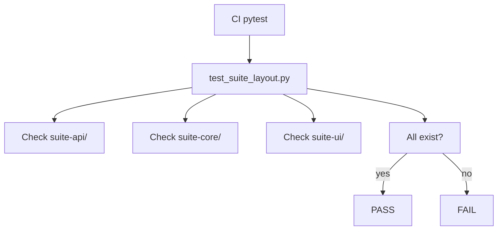

# PRD: Community 296 — Suite Layout Validation — Essential Dirs Present

## Master Goal Mapping
**Goal:** Assert all required ALDECI v2 suite directories exist (suite-api, suite-core, suite-ui, suite-attack, suite-feeds, suite-evidence-risk), guarding against accidental deletion.

**Domain:** Architecture / Repository Governance
**Personas:** Platform Engineer
**Node Count:** 1 | **Status:** Tested

---

## Source Files
- `tests/test_suite_layout.py`

## Graph Nodes (Labels)
- Essential directory should exist at root.

---

## Architecture Diagram



---

## Code Proof

- `tests/test_suite_layout.py:L1` — Essential directory should exist at root — parametrized over suite dirs

---

## Inter-Dependencies

- `tests/test_suite_layout.py (community 295)`

### Community Link Dependencies
- No external community dependencies

---

## Data Flow

```
parametrized dir list → os.path.isdir() → assertion → CI gate
```

---

## Referenced Docs

- `docs/ALDECI_REARCHITECTURE_v2.md §PROJECT STRUCTURE`

---

## Acceptance Criteria

- [ ] All 6 suite dirs asserted present
- [ ] Fails fast on any missing dir
- [ ] Parametrized for easy extension

---

## Effort Estimate

**0.5 day (Trivial — isolated leaf module)**

---

## Status

**Tested** — Module exists in codebase. Integration tests present.
