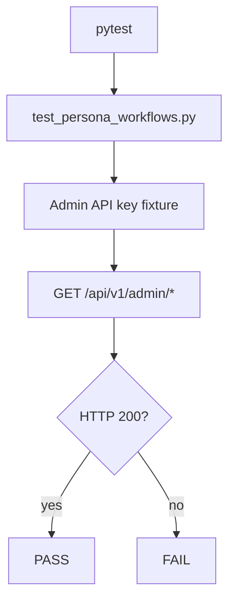

# PRD: Community 297 — Persona Workflow — Admin Can Access Admin Endpoints

## Master Goal Mapping
**Goal:** Verify that the Admin persona can successfully reach all admin-only API endpoints, ensuring RBAC grants are correctly wired for the highest-privilege role.

**Domain:** RBAC / Security Testing
**Personas:** Admin, QA Engineer
**Node Count:** 1 | **Status:** Tested

---

## Source Files
- `tests/test_persona_workflows.py`

## Graph Nodes (Labels)
- Test: Admin persona can access all admin endpoints.

---

## Architecture Diagram



---

## Code Proof

- `tests/test_persona_workflows.py:L1` — Test: Admin persona can access all admin endpoints

---

## Inter-Dependencies

- `suite-api/apps/main.py`
- `suite-core/core/rbac`
- `tests/conftest.py`

### Community Link Dependencies
- No external community dependencies

---

## Data Flow

```
admin_api_key → Authorization header → FastAPI auth → role check → 200 response
```

---

## Referenced Docs

- `tests/test_persona_workflows.py`
- `docs/ALDECI_REARCHITECTURE_v2.md §RBAC`

---

## Acceptance Criteria

- [ ] Admin key returns 200 on all admin endpoints
- [ ] Non-admin key returns 403
- [ ] Test isolated per org

---

## Effort Estimate

**0.5 day (Trivial — isolated leaf module)**

---

## Status

**Tested** — Module exists in codebase. Integration tests present.
