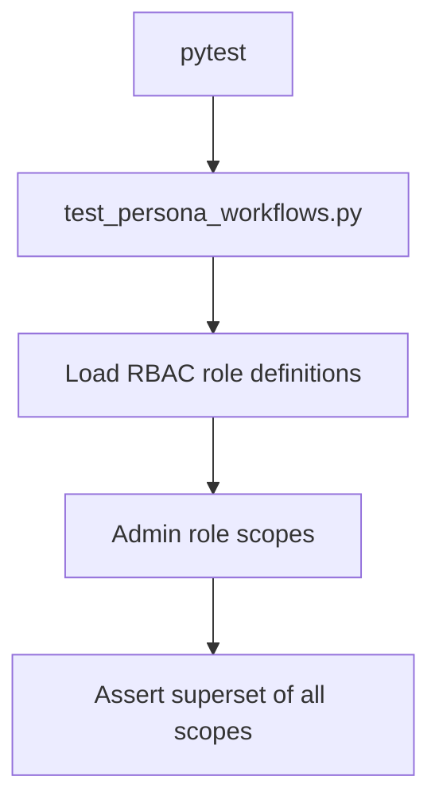

# PRD: Community 298 — Persona Workflow — Admin Role Has Full Scope

## Master Goal Mapping
**Goal:** Assert the Admin RBAC role definition contains all required permission scopes, preventing privilege gaps that could lock admins out of critical operations.

**Domain:** RBAC / Authorization
**Personas:** Admin, Security Engineer
**Node Count:** 1 | **Status:** Tested

---

## Source Files
- `tests/test_persona_workflows.py`

## Graph Nodes (Labels)
- Test: Admin role has full scope.

---

## Architecture Diagram



---

## Code Proof

- `tests/test_persona_workflows.py:L1` — Test: Admin role has full scope — scope superset assertion

---

## Inter-Dependencies

- `suite-core/core/rbac`
- `suite-api/apps/api/`

### Community Link Dependencies
- No external community dependencies

---

## Data Flow

```
RBAC role registry → admin role scopes → set comparison → assert superset
```

---

## Referenced Docs

- `docs/ALDECI_REARCHITECTURE_v2.md §6 RBAC roles`

---

## Acceptance Criteria

- [ ] Admin scope is superset of all other roles
- [ ] Tested against live RBAC registry
- [ ] Fails if new scope added without admin grant

---

## Effort Estimate

**0.5 day (Trivial — isolated leaf module)**

---

## Status

**Tested** — Module exists in codebase. Integration tests present.
