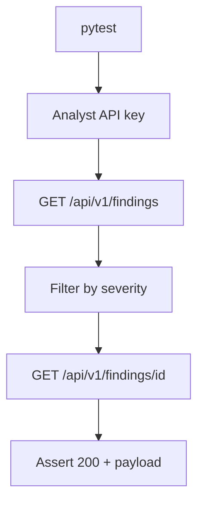

# PRD: Community 299 — Persona Workflow — Analyst Can Investigate Findings

## Master Goal Mapping
**Goal:** Verify the Security Analyst persona can retrieve, filter, and investigate vulnerability findings via the API, confirming read+investigate permissions are correctly scoped.

**Domain:** RBAC / Analyst Workflow
**Personas:** Security Analyst, QA Engineer
**Node Count:** 1 | **Status:** Tested

---

## Source Files
- `tests/test_persona_workflows.py`

## Graph Nodes (Labels)
- Test: Analyst can investigate findings.

---

## Architecture Diagram



---

## Code Proof

- `tests/test_persona_workflows.py:L1` — Test: Analyst can investigate findings — read workflow

---

## Inter-Dependencies

- `suite-api/apps/api/security_findings_router.py`
- `suite-core/core/security_findings_engine.py`

### Community Link Dependencies
- No external community dependencies

---

## Data Flow

```
analyst_key → /findings → engine query → finding details → assertions on fields
```

---

## Referenced Docs

- `suite-core/core/security_findings_engine.py`
- `tests/test_persona_workflows.py`

---

## Acceptance Criteria

- [ ] Analyst GET /findings returns 200
- [ ] Findings filterable by severity/status
- [ ] Analyst cannot DELETE findings (403)

---

## Effort Estimate

**0.5 day (Trivial — isolated leaf module)**

---

## Status

**Tested** — Module exists in codebase. Integration tests present.
