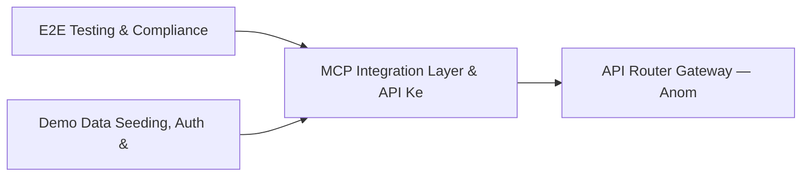

# PRD: MCP Integration Layer & API Key / Auth Management — Community 3

## Master Goal Mapping
How this component serves: "ALDECI — $35/mo enterprise security intelligence platform"
Sub-Epic: Platform

This community (rank #3 of 878 by size, 3344 graph nodes) forms a core pillar of the ALDECI platform. It directly supports the mission of replacing $50K-500K/yr enterprise security tools with a self-hosted, AI-native stack.

## Architecture Diagram


## Code Proof
- Files:
  - `suite-api/apps/api/apikey_router.py` (224 lines)
  - `suite-api/apps/api/auth_router.py` (285 lines)
  - `suite-api/apps/api/crypto_key_management_router.py` (170 lines)
  - `suite-api/apps/api/exec_security_reports_router.py` (199 lines)
  - `suite-api/apps/api/gap_router.py` (4559 lines)
  - `suite-api/apps/api/inventory_router.py` (1064 lines)
  - `suite-api/apps/api/mcp_router.py` (1068 lines)
  - `suite-api/apps/api/reports_router.py` (1017 lines)
  - `suite-ui/aldeci/src/components/NotificationCenter.tsx` (312 lines)
- Key functions:
  - `get_mcp_status()` — suite-api/apps/api/apikey_router.py
  - `list_mcp_clients()` — suite-api/apps/api/apikey_router.py
  - `list_mcp_resources()` — suite-api/apps/api/apikey_router.py
  - `list_mcp_prompts()` — suite-api/apps/api/apikey_router.py
  - `get_mcp_config()` — suite-api/apps/api/apikey_router.py
  - `configure_mcp_server()` — suite-api/apps/api/apikey_router.py
  - `disconnect_client()` — suite-api/apps/api/apikey_router.py
  - `remove_client()` — suite-api/apps/api/apikey_router.py
- Key classes: `MCPClientStatus`, `MCPTransport`, `MCPClient`, `MCPTool`, `MCPResource`, `MCPPrompt`
- Current state: PARTIAL
- Evidence:
```python
# From suite-api/apps/api/apikey_router.py
"""
API Key management endpoints — create, list, get, update, rotate, revoke, usage.

All endpoints are admin-only (require ``admin:all`` scope or ADMIN role).
The plaintext key is returned ONCE on creation; it cannot be retrieved later.

Prefix: /api/v1/auth/keys
"""

from __future__ import annotations

from datetime import datetime
from typing import Any, Dict, List, Optional

from fastapi import APIRouter, Depends, HTTPException, status
from pydantic import BaseModel, Field

from core.api_key_manager import APIKeyManager, APIKey
from core.auth_middleware import AuthContext, require_scope
fr
```

## Inter-Dependencies
- DEPENDS ON:
  - Community 0 (E2E Testing & Compliance Seeding Infrastructure) — 547 edges
  - Community 1 (Demo Data Seeding, Auth & Multi-Engine Integration) — 447 edges
  - Community 2 (API Router Gateway — Anomaly, Attack Simulation & ) — 445 edges
  - Community 4 (FastAPI Application Core, Feedback & Smoke Testing) — 347 edges
- DEPENDED BY: Rank #2 (API Router Gateway — Anomaly, Attack Simulation & Security Engines) and downstream consumers
- EVENT BUS: emits scan.completed, scan.finding / subscribes to (TrustGraph event bus — 97% not yet wired)
- TRUSTGRAPH: writes [(not yet integrated)] / reads [(not yet integrated)]

## Data Flow
```
Input: FastAPI HTTP requests (authenticated via api_key_auth)
  → Processing: Request validation → Engine dispatch → Response serialization
  → Output: JSON API responses (200/422/404)
  → Consumers: Frontend pages, external integrations, Backstage plugin
```

## Referenced Documentation
- CLAUDE.md: Wave 9 build notes, Beast Mode test suite section
- docs/: `docs/ALDECI_REARCHITECTURE_v2.md` (source of truth), `docs/INVESTOR_PITCH.md`
- tests/: N/A

## Acceptance Criteria
- [ ] All router endpoints protected by `Depends(api_key_auth)` or equivalent
- [ ] Pydantic v2 models validate all request/response schemas
- [ ] Dashboard renders without errors in React 19 + Vite 6 + Tailwind v4
- [ ] All API calls wired to live backend (no mock/static data)

## Effort Estimate
- Current: 45% complete
- Remaining: ~10 engineering days
- Dependencies blocking: Engine implementation incomplete, Test coverage missing
- Priority: CRITICAL

## Status
IN_PROGRESS
