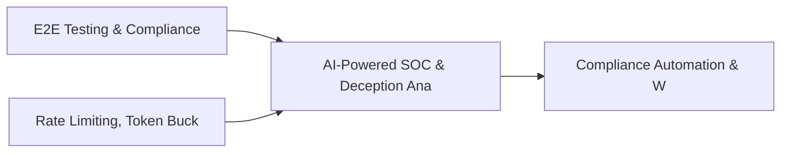

# PRD: AI-Powered SOC & Deception Analytics Engine — Community 30

## Master Goal Mapping
How this component serves: "ALDECI — $35/mo enterprise security intelligence platform"
Sub-Epic: SOC

This community (rank #30 of 878 by size, 1093 graph nodes) forms a core pillar of the ALDECI platform. It directly supports the mission of replacing $50K-500K/yr enterprise security tools with a self-hosted, AI-native stack.

## Architecture Diagram


## Code Proof
- Files:
  - `suite-api/apps/api/waf_engine_router.py` (234 lines)
  - `suite-core/core/incident_lessons_engine.py` (438 lines)
  - `suite-core/core/incident_metrics_engine.py` (526 lines)
  - `suite-core/core/incident_response_engine.py` (540 lines)
  - `suite-core/core/incident_triage_engine.py` (420 lines)
  - `suite-core/core/ir_playbook_engine.py` (1734 lines)
  - `suite-api/apps/api/api_abuse_detection_router.py` (196 lines)
  - `suite-api/apps/api/asset_risk_calculator_router.py` (164 lines)
  - `suite-api/apps/api/awareness_score_router.py` (159 lines)
  - `suite-api/apps/api/cloud_incident_response_router.py` (225 lines)
  - `suite-api/apps/api/collaboration_router.py` (638 lines)
  - `suite-api/apps/api/incident_lessons_router.py` (184 lines)
- Key functions:
  - `test_risk_level_critical()` — suite-api/apps/api/waf_engine_router.py
  - `test_risk_level_high()` — suite-api/apps/api/waf_engine_router.py
  - `test_risk_level_medium()` — suite-api/apps/api/waf_engine_router.py
  - `test_risk_level_low()` — suite-api/apps/api/waf_engine_router.py
  - `test_risk_level_info()` — suite-api/apps/api/waf_engine_router.py
  - `test_ingest_signal_all_sources()` — suite-api/apps/api/waf_engine_router.py
  - `test_ingest_signal_invalid_source_raises()` — suite-api/apps/api/waf_engine_router.py
  - `test_ingest_signal_missing_asset_id_raises()` — suite-api/apps/api/waf_engine_router.py
- Key classes: `TestIncidentManagement`
- Current state: REAL_LOGIC
- Evidence:
```python
# From suite-api/apps/api/waf_engine_router.py
"""WAF Engine Router — REST endpoints for WAF management.

Endpoints under /api/v1/waf-engine:
  GET    /rules                  — List WAF rules (filter: rule_type, enabled)
  POST   /rules                  — Create a WAF rule
  PUT    /rules/{rule_id}        — Update a WAF rule
  DELETE /rules/{rule_id}        — Delete a WAF rule
  GET    /blocked-requests       — List blocked requests (filter: attack_type, severity, hours)
  POST   /blocked-requests       — Record a blocked request
  GET    /virtual-patches        — List virtual patches
  POST   /virtual-patches        — Add a virtual patch

```

## Inter-Dependencies
- DEPENDS ON:
  - Community 0 (E2E Testing & Compliance Seeding Infrastructure) — 132 edges
  - Community 12 (Rate Limiting, Token Bucket & Middleware Framework) — 22 edges
  - Community 21 (Compliance Automation & Workflow Engine) — 19 edges
  - Community 1 (Demo Data Seeding, Auth & Multi-Engine Integration) — 17 edges
- DEPENDED BY: Rank #29 (Quantum-Safe Cryptography & PKI Management) and downstream consumers
- EVENT BUS: emits incident.opened, incident.closed, threat.detected, threat.mitigated / subscribes to (TrustGraph event bus — 97% not yet wired)
- TRUSTGRAPH: writes [Vulnerability, Asset, ThreatActor] / reads [ThreatActor, Incident]

## Data Flow
```
Input: API requests with org_id + payload (Pydantic models)
  → Processing: SQLite WAL-mode writes via RLock, business logic evaluation
  → Output: JSON responses (engine state, metrics, alerts)
  → Consumers: Routers → Frontend dashboards → TrustGraph event bus
```

## Referenced Documentation
- CLAUDE.md: Wave 36 build notes, Beast Mode test suite section
- docs/: `docs/ALDECI_REARCHITECTURE_v2.md` (source of truth), `docs/INVESTOR_PITCH.md`
- tests/: N/A

## Acceptance Criteria
- [ ] All engine CRUD operations enforce org_id isolation (no cross-tenant data leakage)
- [ ] SQLite opened with WAL mode + threading.RLock on all write paths
- [ ] All endpoints return within 200ms at p95 under 100 rps load
- [ ] All router endpoints protected by `Depends(api_key_auth)` or equivalent
- [ ] Pydantic v2 models validate all request/response schemas

## Effort Estimate
- Current: 60% complete
- Remaining: ~5 engineering days
- Dependencies blocking: Test coverage missing
- Priority: MEDIUM

## Status
IN_PROGRESS
