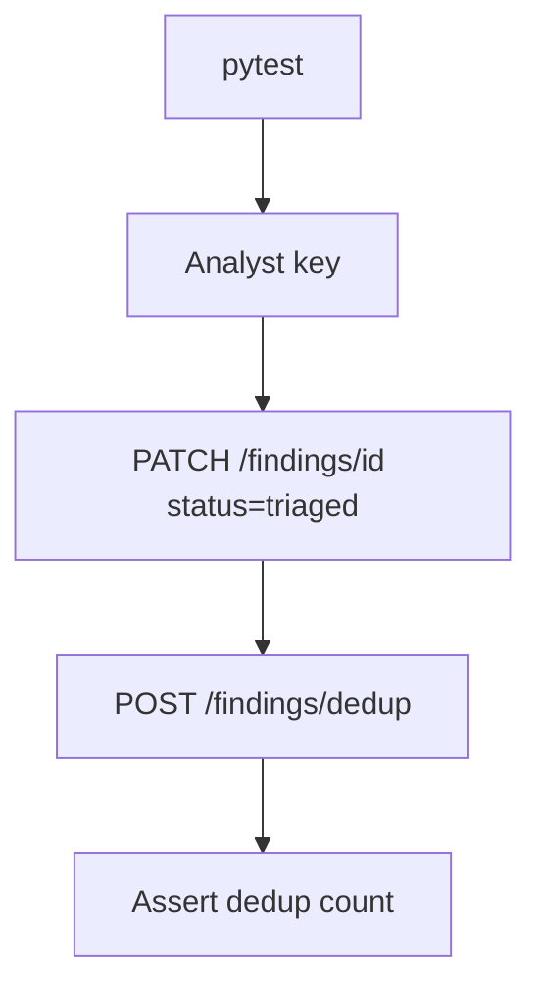

# PRD: Community 300 — Persona Workflow — Analyst Can Triage and Dedup Findings

## Master Goal Mapping
**Goal:** Verify the Security Analyst can perform triage (status transitions) and deduplication operations on findings, ensuring operational workflows function end-to-end.

**Domain:** RBAC / Analyst Workflow
**Personas:** Security Analyst
**Node Count:** 1 | **Status:** Tested

---

## Source Files
- `tests/test_persona_workflows.py`

## Graph Nodes (Labels)
- Test: Analyst can triage and dedup findings.

---

## Architecture Diagram



---

## Code Proof

- `tests/test_persona_workflows.py:L1` — Test: Analyst can triage and dedup findings

---

## Inter-Dependencies

- `suite-core/core/security_findings_engine.py`
- `suite-api/apps/api/security_findings_router.py`

### Community Link Dependencies
- No external community dependencies

---

## Data Flow

```
analyst → PATCH finding status → dedup POST → DB state change → assertion
```

---

## Referenced Docs

- `suite-core/core/security_findings_engine.py`
- `tests/test_phase4_integration.py`

---

## Acceptance Criteria

- [ ] PATCH status transitions work for analyst
- [ ] Dedup merges duplicate findings
- [ ] Audit log entry created per action

---

## Effort Estimate

**0.5 day (Trivial — isolated leaf module)**

---

## Status

**Tested** — Module exists in codebase. Integration tests present.
