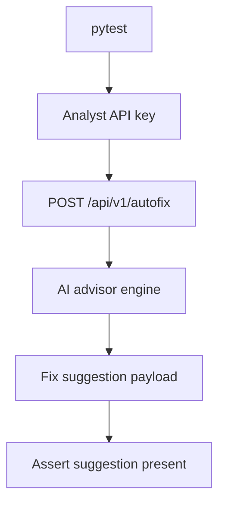

# PRD: Community 301 — Persona Workflow — Analyst Can Request Autofix Suggestions

## Master Goal Mapping
**Goal:** Verify Security Analysts can request AI-powered autofix suggestions for findings via the copilot endpoint, enabling faster remediation workflows.

**Domain:** RBAC / AI-Assisted Remediation
**Personas:** Security Analyst
**Node Count:** 1 | **Status:** Tested

---

## Source Files
- `tests/test_persona_workflows.py`

## Graph Nodes (Labels)
- Test: Analyst can request autofix suggestions.

---

## Architecture Diagram



---

## Code Proof

- `tests/test_persona_workflows.py:L1` — Test: Analyst can request autofix suggestions

---

## Inter-Dependencies

- `suite-core/core/ai_security_advisor_engine.py`
- `suite-api/apps/api/`

### Community Link Dependencies
- No external community dependencies

---

## Data Flow

```
analyst → POST /autofix {finding_id} → ai_advisor → LLM suggestion → HTTP 200 + suggestion
```

---

## Referenced Docs

- `suite-core/core/ai_security_advisor_engine.py`
- `tests/test_persona_workflows.py`

---

## Acceptance Criteria

- [ ] Analyst POST /autofix returns 200
- [ ] Response contains fix_suggestion field
- [ ] Non-analyst role returns 403

---

## Effort Estimate

**0.5 day (Trivial — isolated leaf module)**

---

## Status

**Tested** — Module exists in codebase. Integration tests present.
