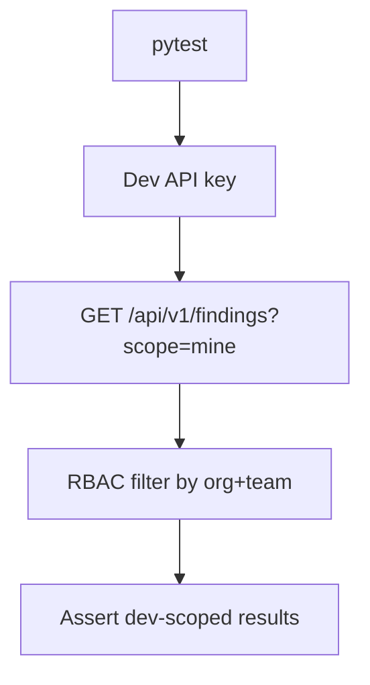

# PRD: Community 302 — Persona Workflow — Dev Can View Their Findings

## Master Goal Mapping
**Goal:** Verify the Developer persona can view findings scoped to their team/project, enforcing data isolation so devs only see relevant security findings.

**Domain:** RBAC / Developer Workflow
**Personas:** Developer
**Node Count:** 1 | **Status:** Tested

---

## Source Files
- `tests/test_persona_workflows.py`

## Graph Nodes (Labels)
- Test: Dev can view their findings.

---

## Architecture Diagram



---

## Code Proof

- `tests/test_persona_workflows.py:L1` — Test: Dev can view their findings — scoped read test

---

## Inter-Dependencies

- `suite-core/core/security_findings_engine.py`
- `suite-api/apps/api/`

### Community Link Dependencies
- No external community dependencies

---

## Data Flow

```
dev_key → /findings → org_id+team filter → developer-scoped findings → assertions
```

---

## Referenced Docs

- `docs/ALDECI_REARCHITECTURE_v2.md §30 personas`
- `tests/test_persona_workflows.py`

---

## Acceptance Criteria

- [ ] Dev sees only own-team findings
- [ ] Cannot see other teams findings
- [ ] Filter applied at DB query level

---

## Effort Estimate

**0.5 day (Trivial — isolated leaf module)**

---

## Status

**Tested** — Module exists in codebase. Integration tests present.
