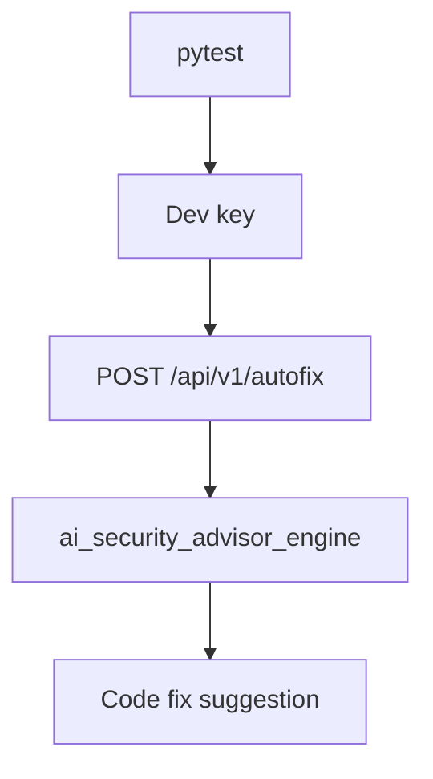

# PRD: Community 303 — Persona Workflow — Dev Can Get Autofix Suggestions

## Master Goal Mapping
**Goal:** Verify Developers can request autofix suggestions for their findings, enabling DevSecOps shift-left by bringing AI remediation guidance directly to engineering.

**Domain:** RBAC / DevSecOps
**Personas:** Developer
**Node Count:** 1 | **Status:** Tested

---

## Source Files
- `tests/test_persona_workflows.py`

## Graph Nodes (Labels)
- Test: Dev can get autofix suggestions.

---

## Architecture Diagram



---

## Code Proof

- `tests/test_persona_workflows.py:L1` — Test: Dev can get autofix suggestions

---

## Inter-Dependencies

- `suite-core/core/ai_security_advisor_engine.py`

### Community Link Dependencies
- No external community dependencies

---

## Data Flow

```
dev → POST /autofix → ai advisor → LLM-generated code fix → response
```

---

## Referenced Docs

- `suite-core/core/ai_security_advisor_engine.py`
- `suite-core/core/devsecops_engine.py`

---

## Acceptance Criteria

- [ ] Dev POST /autofix returns 200
- [ ] Suggestion includes code snippet
- [ ] Rate limited to prevent abuse

---

## Effort Estimate

**0.5 day (Trivial — isolated leaf module)**

---

## Status

**Tested** — Module exists in codebase. Integration tests present.
