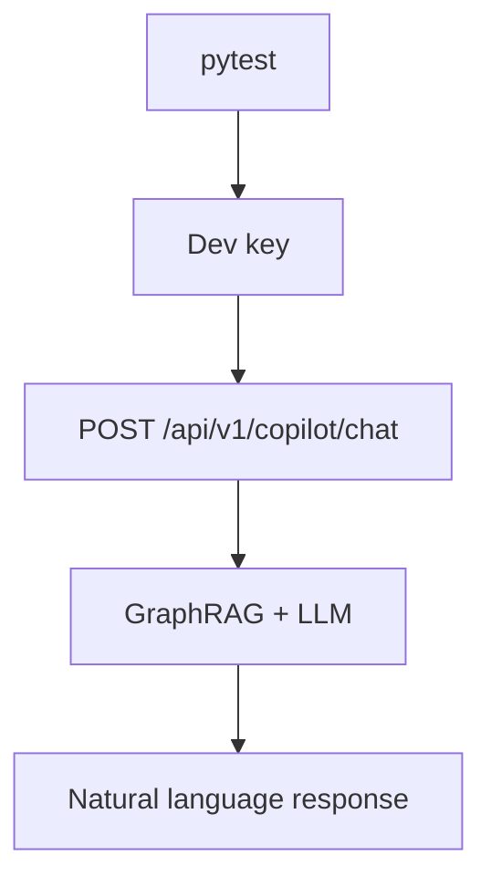

# PRD: Community 304 — Persona Workflow — Dev Can Ask Copilot for Help

## Master Goal Mapping
**Goal:** Verify the Developer persona can interact with the ALDECI security copilot for contextual guidance, enabling natural language security Q&A during development.

**Domain:** RBAC / Copilot / AI
**Personas:** Developer
**Node Count:** 1 | **Status:** Tested

---

## Source Files
- `tests/test_persona_workflows.py`

## Graph Nodes (Labels)
- Test: Dev can ask copilot for help.

---

## Architecture Diagram



---

## Code Proof

- `tests/test_persona_workflows.py:L1` — Test: Dev can ask copilot for help — chat endpoint test

---

## Inter-Dependencies

- `suite-integrations/`
- `trustgraph/`
- `suite-api/apps/api/`

### Community Link Dependencies
- No external community dependencies

---

## Data Flow

```
dev → POST /copilot/chat {question} → GraphRAG retrieval → LLM → answer → HTTP 200
```

---

## Referenced Docs

- `suite-integrations/`
- `docs/ALDECI_REARCHITECTURE_v2.md §TrustGraph`

---

## Acceptance Criteria

- [ ] POST /copilot/chat returns 200
- [ ] Response has answer field
- [ ] Context includes relevant findings

---

## Effort Estimate

**0.5 day (Trivial — isolated leaf module)**

---

## Status

**Tested** — Module exists in codebase. Integration tests present.
