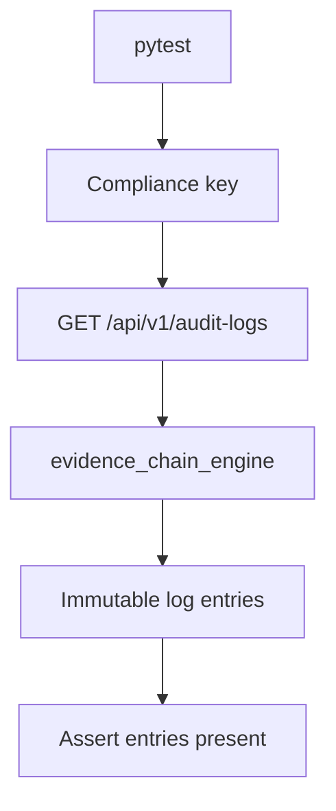

# PRD: Community 305 — Persona Workflow — Compliance Can Access Audit Logs

## Master Goal Mapping
**Goal:** Verify Compliance Officers can retrieve full audit logs via the API, enabling evidence collection for SOC 2, ISO 27001, and PCI-DSS compliance audits.

**Domain:** RBAC / Compliance
**Personas:** Compliance Officer
**Node Count:** 1 | **Status:** Tested

---

## Source Files
- `tests/test_persona_workflows.py`

## Graph Nodes (Labels)
- Test: Compliance can access audit logs.

---

## Architecture Diagram



---

## Code Proof

- `tests/test_persona_workflows.py:L1` — Test: Compliance can access audit logs

---

## Inter-Dependencies

- `suite-core/core/evidence_chain_engine.py`
- `suite-api/apps/api/`

### Community Link Dependencies
- No external community dependencies

---

## Data Flow

```
compliance_key → /audit-logs → evidence_chain_engine.list() → sealed entries → HTTP 200
```

---

## Referenced Docs

- `suite-core/core/evidence_chain_engine.py`
- `SOC 2 CC7.2`

---

## Acceptance Criteria

- [ ] Compliance GET /audit-logs returns 200
- [ ] Log entries include actor+action+timestamp
- [ ] Entries cannot be deleted via API

---

## Effort Estimate

**0.5 day (Trivial — isolated leaf module)**

---

## Status

**Tested** — Module exists in codebase. Integration tests present.
