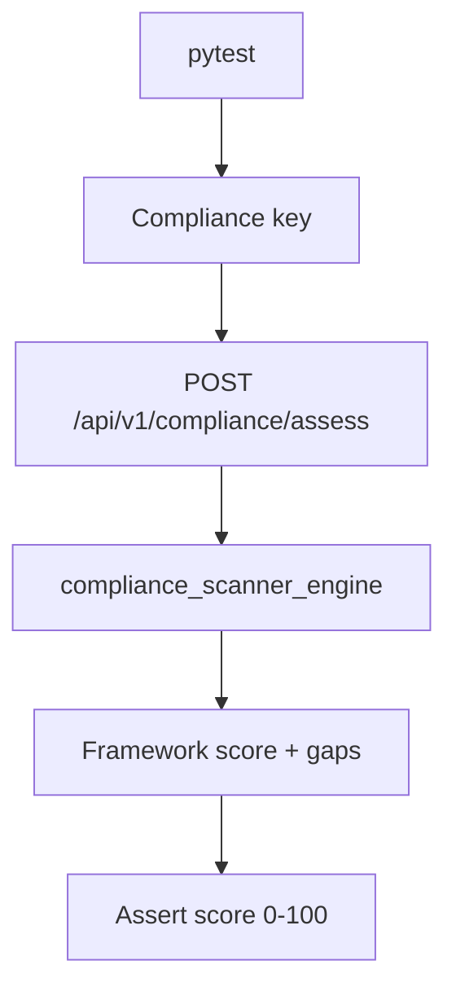

# PRD: Community 306 — Persona Workflow — Compliance Can Assess Frameworks

## Master Goal Mapping
**Goal:** Verify Compliance Officers can trigger framework assessments (SOC 2, PCI-DSS, ISO 27001) and retrieve compliance scores via the API.

**Domain:** RBAC / Compliance Assessment
**Personas:** Compliance Officer
**Node Count:** 1 | **Status:** Tested

---

## Source Files
- `tests/test_persona_workflows.py`

## Graph Nodes (Labels)
- Test: Compliance can assess frameworks.

---

## Architecture Diagram



---

## Code Proof

- `tests/test_persona_workflows.py:L1` — Test: Compliance can assess frameworks

---

## Inter-Dependencies

- `suite-core/core/compliance_scanner_engine.py`
- `suite-core/core/cloud_compliance_engine.py`

### Community Link Dependencies
- No external community dependencies

---

## Data Flow

```
compliance_key → POST /compliance/assess {framework} → scanner → score + gaps → HTTP 200
```

---

## Referenced Docs

- `suite-core/core/compliance_scanner_engine.py`
- `suite-core/core/compliance_mapping_engine.py`

---

## Acceptance Criteria

- [ ] POST assess returns score 0-100
- [ ] Gaps list non-empty for partial compliance
- [ ] Supports SOC2/PCI-DSS/ISO27001/NIST

---

## Effort Estimate

**0.5 day (Trivial — isolated leaf module)**

---

## Status

**Tested** — Module exists in codebase. Integration tests present.
