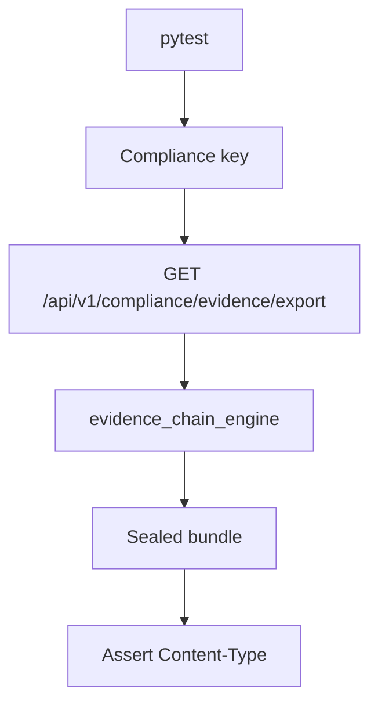

# PRD: Community 307 — Persona Workflow — Compliance Can Export Evidence

## Master Goal Mapping
**Goal:** Verify Compliance Officers can export compliance evidence bundles (PDF/JSON) for external auditors, satisfying audit artifact delivery requirements.

**Domain:** RBAC / Evidence Export
**Personas:** Compliance Officer, Auditor
**Node Count:** 1 | **Status:** Tested

---

## Source Files
- `tests/test_persona_workflows.py`

## Graph Nodes (Labels)
- Test: Compliance can export evidence.

---

## Architecture Diagram



---

## Code Proof

- `tests/test_persona_workflows.py:L1` — Test: Compliance can export evidence

---

## Inter-Dependencies

- `suite-core/core/evidence_chain_engine.py`
- `suite-core/core/compliance_evidence_collector.py`

### Community Link Dependencies
- No external community dependencies

---

## Data Flow

```
compliance_key → GET /evidence/export → sealed bundle → download stream → assertion
```

---

## Referenced Docs

- `suite-core/core/evidence_chain_engine.py`
- `suite-core/core/evidence_vault_engine.py`

---

## Acceptance Criteria

- [ ] Export returns 200 + binary content
- [ ] Bundle includes SHA-256 integrity hash
- [ ] Sealed bundle cannot be tampered

---

## Effort Estimate

**0.5 day (Trivial — isolated leaf module)**

---

## Status

**Tested** — Module exists in codebase. Integration tests present.
