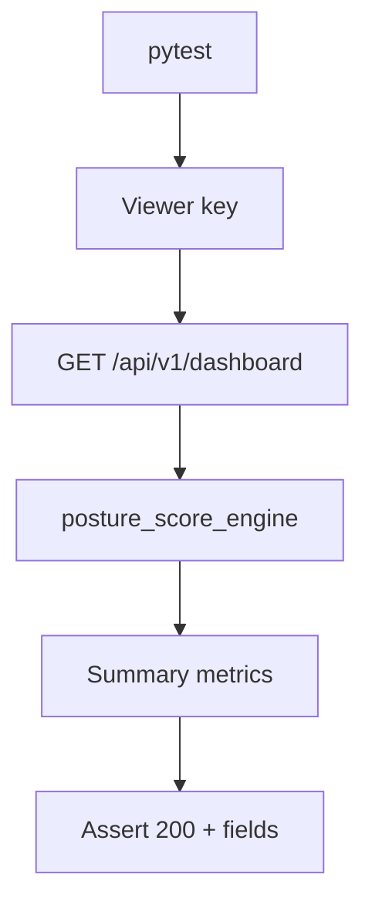

# PRD: Community 308 — Persona Workflow — Viewer Can See Dashboard

## Master Goal Mapping
**Goal:** Verify read-only Viewer personas can access dashboard summary endpoints without modification rights, supporting executive and stakeholder read-only access.

**Domain:** RBAC / Read-Only Access
**Personas:** Viewer, Executive
**Node Count:** 1 | **Status:** Tested

---

## Source Files
- `tests/test_persona_workflows.py`

## Graph Nodes (Labels)
- Test: Viewer can see dashboard.

---

## Architecture Diagram



---

## Code Proof

- `tests/test_persona_workflows.py:L1` — Test: Viewer can see dashboard

---

## Inter-Dependencies

- `suite-api/apps/api/`
- `suite-core/core/posture_score_engine.py`

### Community Link Dependencies
- No external community dependencies

---

## Data Flow

```
viewer_key → GET /dashboard → posture_score_engine → summary metrics → HTTP 200
```

---

## Referenced Docs

- `docs/ALDECI_REARCHITECTURE_v2.md §30 personas`
- `suite-core/core/security_metrics_dashboard_engine.py`

---

## Acceptance Criteria

- [ ] Viewer GET /dashboard returns 200
- [ ] Response includes risk_score and trend
- [ ] Cannot POST/PATCH/DELETE (403)

---

## Effort Estimate

**0.5 day (Trivial — isolated leaf module)**

---

## Status

**Tested** — Module exists in codebase. Integration tests present.
