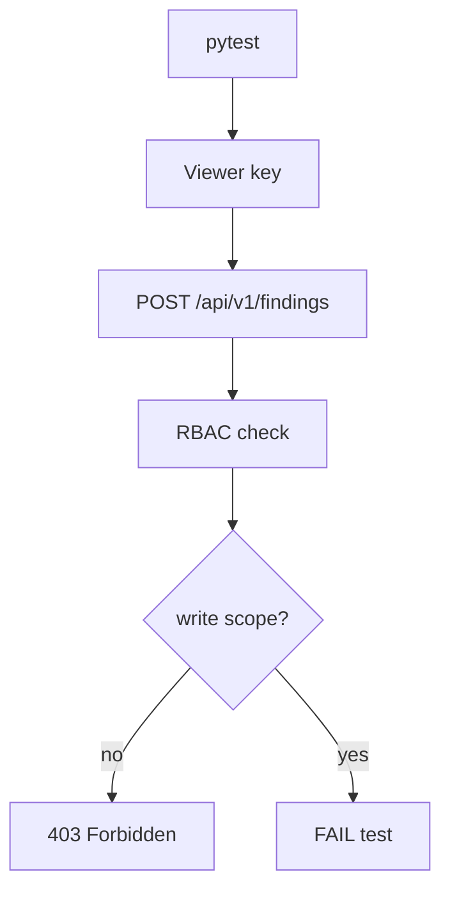

# PRD: Community 309 — Persona Workflow — Viewer Role Cannot Modify Resources

## Master Goal Mapping
**Goal:** Assert the Viewer RBAC role is correctly restricted from all write operations, preventing accidental privilege escalation for read-only stakeholders.

**Domain:** RBAC / Authorization Guard
**Personas:** Viewer, Security Engineer
**Node Count:** 1 | **Status:** Tested

---

## Source Files
- `tests/test_persona_workflows.py`

## Graph Nodes (Labels)
- Test: Viewer role cannot modify resources.

---

## Architecture Diagram



---

## Code Proof

- `tests/test_persona_workflows.py:L1` — Test: Viewer role cannot modify resources — 403 assertion

---

## Inter-Dependencies

- `suite-api/apps/api/`
- `suite-core/core/rbac`

### Community Link Dependencies
- No external community dependencies

---

## Data Flow

```
viewer_key → POST/PATCH/DELETE request → RBAC middleware → 403 response → assertion
```

---

## Referenced Docs

- `docs/ALDECI_REARCHITECTURE_v2.md §RBAC`
- `suite-api/apps/api/auth.py`

---

## Acceptance Criteria

- [ ] All write methods return 403 for viewer
- [ ] Tested for POST, PATCH, DELETE
- [ ] No privilege escalation via headers

---

## Effort Estimate

**0.5 day (Trivial — isolated leaf module)**

---

## Status

**Tested** — Module exists in codebase. Integration tests present.
