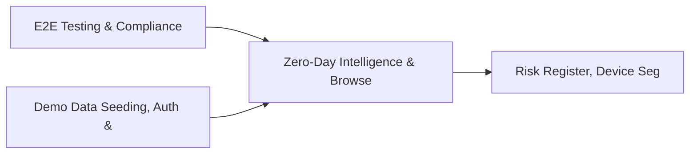

# PRD: Zero-Day Intelligence & Browser Security Engine — Community 31

## Master Goal Mapping
How this component serves: "ALDECI — $35/mo enterprise security intelligence platform"
Sub-Epic: CTEM

This community (rank #31 of 878 by size, 1088 graph nodes) forms a core pillar of the ALDECI platform. It directly supports the mission of replacing $50K-500K/yr enterprise security tools with a self-hosted, AI-native stack.

## Architecture Diagram


## Code Proof
- Files:
  - `suite-api/apps/api/cloud_security_engine_router.py` (242 lines)
  - `suite-core/core/application_risk_engine.py` (426 lines)
  - `suite-core/core/cloud_security_findings_engine.py` (463 lines)
  - `suite-core/core/compliance_mapping_engine.py` (571 lines)
  - `suite-core/core/digital_twin_security_engine.py` (434 lines)
  - `suite-core/core/red_team_mgmt_engine.py` (547 lines)
  - `suite-core/core/security_architecture_review_engine.py` (405 lines)
  - `suite-core/core/user_access_review_engine.py` (397 lines)
  - `suite-api/apps/api/anti_phishing_router.py` (178 lines)
  - `suite-api/apps/api/application_risk_router.py` (171 lines)
  - `suite-api/apps/api/attack_simulation_router.py` (182 lines)
  - `suite-api/apps/api/cloud_security_engine_router.py` (242 lines)
- Key functions:
  - `test_add_control()` — suite-api/apps/api/cloud_security_engine_router.py
  - `test_submit_url_basic()` — suite-api/apps/api/cloud_security_engine_router.py
  - `test_submit_url_all_sources()` — suite-api/apps/api/cloud_security_engine_router.py
  - `test_submit_url_missing_url()` — suite-api/apps/api/cloud_security_engine_router.py
  - `test_submit_url_invalid_source()` — suite-api/apps/api/cloud_security_engine_router.py
  - `test_analyze_url_basic()` — suite-api/apps/api/cloud_security_engine_router.py
  - `test_analyze_url_all_verdicts()` — suite-api/apps/api/cloud_security_engine_router.py
  - `test_analyze_url_confidence_clamp_high()` — suite-api/apps/api/cloud_security_engine_router.py
- Key classes: N/A
- Current state: REAL_LOGIC
- Evidence:
```python
# From suite-api/apps/api/cloud_security_engine_router.py
"""Cloud Security Engine Router — ALDECI.

Endpoints for CSPM + cloud misconfiguration tracking.

Prefix: /api/v1/cloud-security-engine
Auth:   api_key_auth dependency

Routes:
  POST   /accounts                         add_account
  GET    /accounts                         list_accounts
  POST   /findings                         add_finding
  GET    /findings                         list_findings
  PATCH  /findings/{finding_id}/resolve    resolve_finding
  POST   /resources                        add_resource
  GET    /resources                        list_resources
  POST   /benchmarks      
```

## Inter-Dependencies
- DEPENDS ON:
  - Community 0 (E2E Testing & Compliance Seeding Infrastructure) — 164 edges
  - Community 1 (Demo Data Seeding, Auth & Multi-Engine Integration) — 48 edges
  - Community 17 (Risk Register, Device Segmentation & Isolation Tes) — 25 edges
  - Community 29 (Quantum-Safe Cryptography & PKI Management) — 23 edges
- DEPENDED BY: Rank #30 (AI-Powered SOC & Deception Analytics Engine) and downstream consumers
- EVENT BUS: emits (none currently wired) / subscribes to (TrustGraph event bus — 97% not yet wired)
- TRUSTGRAPH: writes [Identity, ComplianceControl, CloudResource] / reads [ComplianceControl, CloudResource]

## Data Flow
```
Input: HTTP requests / pytest fixtures
  → Processing: Engine method calls + SQLite state assertions
  → Output: Pass/fail test results, coverage metrics
  → Consumers: CI/CD pipeline, Beast Mode test suite
```

## Referenced Documentation
- CLAUDE.md: Wave 37 build notes, Beast Mode test suite section
- docs/: `docs/ALDECI_REARCHITECTURE_v2.md` (source of truth), `docs/INVESTOR_PITCH.md`
- tests/: `suite-api/apps/api/pentest_mgmt_router.py`, `suite-core/core/pentest_manager.py`, `tests/test_anti_phishing_engine.py`

## Acceptance Criteria
- [ ] All engine CRUD operations enforce org_id isolation (no cross-tenant data leakage)
- [ ] SQLite opened with WAL mode + threading.RLock on all write paths
- [ ] All endpoints return within 200ms at p95 under 100 rps load
- [ ] All router endpoints protected by `Depends(api_key_auth)` or equivalent
- [ ] Pydantic v2 models validate all request/response schemas
- [ ] Test suite achieves ≥80% branch coverage on engine methods

## Effort Estimate
- Current: 80% complete
- Remaining: ~2 engineering days
- Dependencies blocking: None
- Priority: MEDIUM

## Status
IN_PROGRESS
