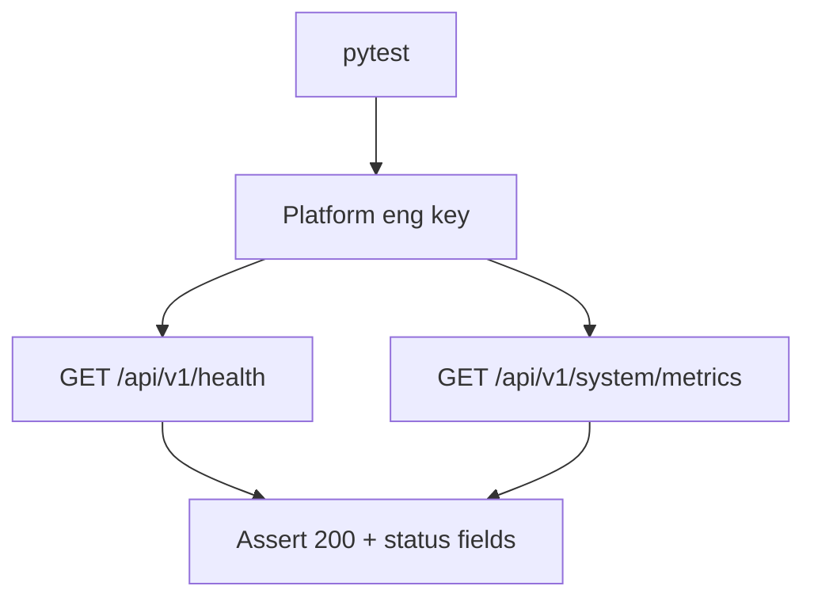

# PRD: Community 310 — Persona Workflow — Platform Eng Can Check System Health

## Master Goal Mapping
**Goal:** Verify Platform Engineers can access system health and diagnostics endpoints to monitor ALDECI infrastructure health in production environments.

**Domain:** RBAC / Platform Operations
**Personas:** Platform Engineer
**Node Count:** 1 | **Status:** Tested

---

## Source Files
- `tests/test_persona_workflows.py`

## Graph Nodes (Labels)
- Test: Platform eng can check system health.

---

## Architecture Diagram



---

## Code Proof

- `tests/test_persona_workflows.py:L1` — Test: Platform eng can check system health

---

## Inter-Dependencies

- `suite-api/apps/main.py`
- `suite-core/core/security_health_engine.py`

### Community Link Dependencies
- No external community dependencies

---

## Data Flow

```
platform_key → GET /health → service status checks → HTTP 200 + uptime
```

---

## Referenced Docs

- `suite-core/core/security_health_engine.py`
- `suite-api/apps/main.py`

---

## Acceptance Criteria

- [ ] GET /health returns 200
- [ ] Response includes all service statuses
- [ ] Latency metrics included

---

## Effort Estimate

**0.5 day (Trivial — isolated leaf module)**

---

## Status

**Tested** — Module exists in codebase. Integration tests present.
