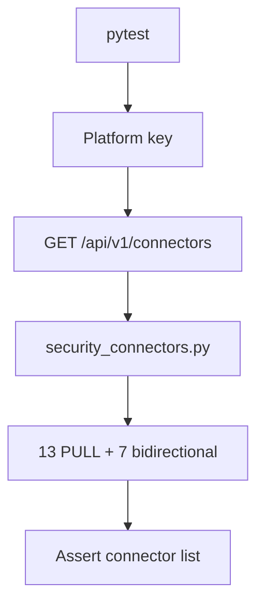

# PRD: Community 311 — Persona Workflow — Platform Eng Can View Connectors

## Master Goal Mapping
**Goal:** Verify Platform Engineers can list and inspect all configured pull connectors and bidirectional connectors, enabling integration monitoring and troubleshooting.

**Domain:** RBAC / Connector Management
**Personas:** Platform Engineer
**Node Count:** 1 | **Status:** Tested

---

## Source Files
- `tests/test_persona_workflows.py`

## Graph Nodes (Labels)
- Test: Platform eng can view connectors.

---

## Architecture Diagram



---

## Code Proof

- `tests/test_persona_workflows.py:L1` — Test: Platform eng can view connectors

---

## Inter-Dependencies

- `suite-core/core/security_connectors.py`
- `suite-core/core/connectors.py`

### Community Link Dependencies
- No external community dependencies

---

## Data Flow

```
platform_key → GET /connectors → security_connectors.list() → 20 connectors → HTTP 200
```

---

## Referenced Docs

- `suite-core/core/security_connectors.py`
- `suite-core/core/connectors.py`

---

## Acceptance Criteria

- [ ] GET /connectors returns 20 connectors
- [ ] Each connector has type/status/last_sync
- [ ] Platform eng cannot delete connectors (403)

---

## Effort Estimate

**0.5 day (Trivial — isolated leaf module)**

---

## Status

**Tested** — Module exists in codebase. Integration tests present.
