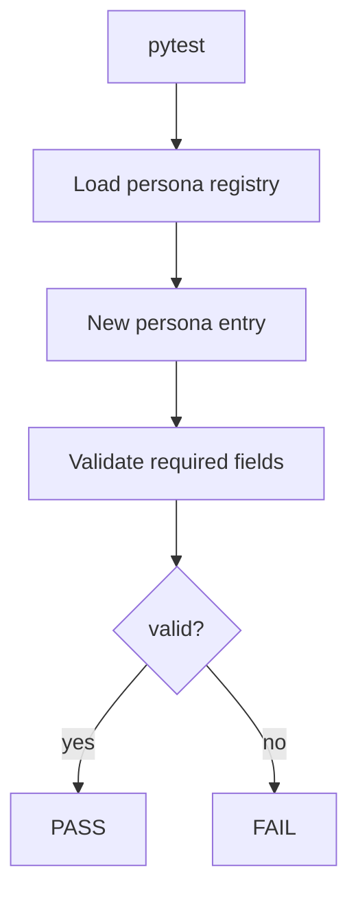

# PRD: Community 312 — Persona Workflow — New Persona Has Valid Workflow Definition

## Master Goal Mapping
**Goal:** Assert that any newly registered ALDECI persona has a complete workflow definition with required fields, preventing half-configured personas from reaching production.

**Domain:** Persona Framework / Validation
**Personas:** Platform Engineer, Admin
**Node Count:** 1 | **Status:** Tested

---

## Source Files
- `tests/test_persona_workflows.py`

## Graph Nodes (Labels)
- Test: New persona has valid workflow definition.

---

## Architecture Diagram



---

## Code Proof

- `tests/test_persona_workflows.py:L1` — Test: New persona has valid workflow definition

---

## Inter-Dependencies

- `suite-core/core/rbac`
- `docs/ALDECI_REARCHITECTURE_v2.md §30 personas`

### Community Link Dependencies
- No external community dependencies

---

## Data Flow

```
persona registry → load definition → validate schema → assert required fields present
```

---

## Referenced Docs

- `docs/ALDECI_REARCHITECTURE_v2.md §30 personas`

---

## Acceptance Criteria

- [ ] Persona has name, role, scopes, endpoints
- [ ] Missing fields fail validation
- [ ] All 30 existing personas pass

---

## Effort Estimate

**0.5 day (Trivial — isolated leaf module)**

---

## Status

**Tested** — Module exists in codebase. Integration tests present.
