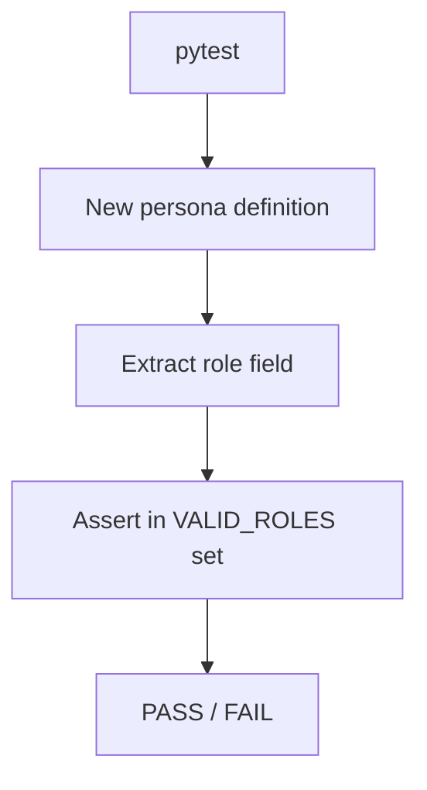

# PRD: Community 313 — Persona Workflow — New Persona RBAC Role Is Valid

## Master Goal Mapping
**Goal:** Assert new ALDECI personas have a valid RBAC role from the allowed set (admin/analyst/developer/compliance/viewer/platform_eng), preventing undefined role assignments.

**Domain:** Persona Framework / RBAC Validation
**Personas:** Platform Engineer, Admin
**Node Count:** 1 | **Status:** Tested

---

## Source Files
- `tests/test_persona_workflows.py`

## Graph Nodes (Labels)
- Test: New persona RBAC role is valid.

---

## Architecture Diagram



---

## Code Proof

- `tests/test_persona_workflows.py:L1` — Test: New persona RBAC role is valid

---

## Inter-Dependencies

- `suite-core/core/rbac`
- `tests/test_persona_workflows.py community 312`

### Community Link Dependencies
- No external community dependencies

---

## Data Flow

```
persona.role → VALID_ROLES set membership check → assertion pass/fail
```

---

## Referenced Docs

- `docs/ALDECI_REARCHITECTURE_v2.md §6 RBAC roles`

---

## Acceptance Criteria

- [ ] Role in {admin,analyst,developer,compliance,viewer,platform_eng}
- [ ] Invalid role fails test
- [ ] Extensible for new roles

---

## Effort Estimate

**0.5 day (Trivial — isolated leaf module)**

---

## Status

**Tested** — Module exists in codebase. Integration tests present.
