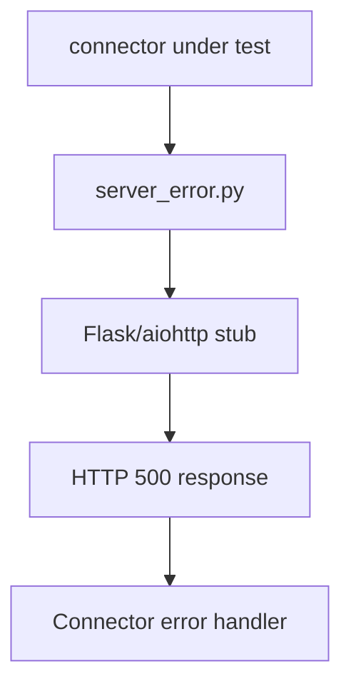

# PRD: Community 316 — APP2 Partner Simulator — Server Error

## Master Goal Mapping
**Goal:** Simulate 5xx server error responses from APP2 partner endpoints to test ALDECI connector resilience, retry logic, and error reporting under partner outages.

**Domain:** Testing / Partner Simulation
**Personas:** QA Engineer, Platform Engineer
**Node Count:** 1 | **Status:** Tested

---

## Source Files
- `tests/APP2/partner_simulators/server_error.py`

## Graph Nodes (Labels)
- server_error.py

---

## Architecture Diagram



---

## Code Proof

- `tests/APP2/partner_simulators/server_error.py:L1` — Partner simulator returning 500 errors for resilience testing

---

## Inter-Dependencies

- `tests/APP2/perf_k6.js`
- `suite-core/core/connectors.py`

### Community Link Dependencies
- No external community dependencies

---

## Data Flow

```
connector request → simulator server → 500 Internal Server Error → connector retry/error log
```

---

## Referenced Docs

- `suite-core/core/connectors.py`
- `tests/APP2/partner_simulators/timeout_simulation.py`

---

## Acceptance Criteria

- [ ] Simulator returns HTTP 500
- [ ] Connector retries N times
- [ ] Error logged with partner ID

---

## Effort Estimate

**0.5 day (Trivial — isolated leaf module)**

---

## Status

**Tested** — Module exists in codebase. Integration tests present.
