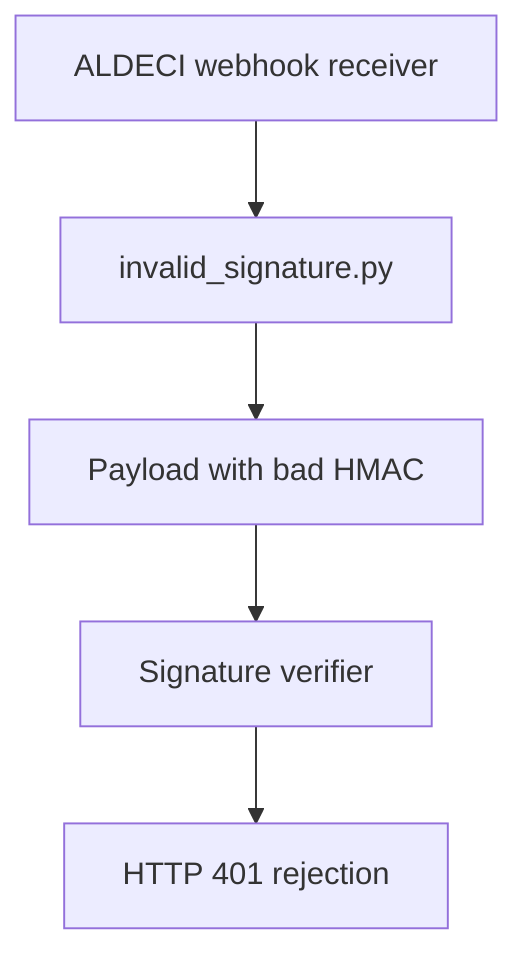

# PRD: Community 317 — APP2 Partner Simulator — Invalid Signature

## Master Goal Mapping
**Goal:** Simulate APP2 partner webhook payloads with invalid HMAC signatures to test ALDECI signature verification and rejection logic.

**Domain:** Testing / Security / Webhook Validation
**Personas:** QA Engineer, Security Engineer
**Node Count:** 1 | **Status:** Tested

---

## Source Files
- `tests/APP2/partner_simulators/invalid_signature.py`

## Graph Nodes (Labels)
- invalid_signature.py

---

## Architecture Diagram



---

## Code Proof

- `tests/APP2/partner_simulators/invalid_signature.py:L1` — Simulator sending payloads with invalid HMAC signatures

---

## Inter-Dependencies

- `suite-core/core/connectors.py`
- `tests/APP2/partner_simulators/`

### Community Link Dependencies
- No external community dependencies

---

## Data Flow

```
simulator → POST webhook with bad_sig → ALDECI verifier → HMAC mismatch → 401 + log entry
```

---

## Referenced Docs

- `suite-core/core/connectors.py`
- `tests/APP3/partner_simulators/invalid_signature.py`

---

## Acceptance Criteria

- [ ] Invalid signature rejected with 401
- [ ] Event NOT processed on bad signature
- [ ] Security log entry created

---

## Effort Estimate

**0.5 day (Trivial — isolated leaf module)**

---

## Status

**Tested** — Module exists in codebase. Integration tests present.
