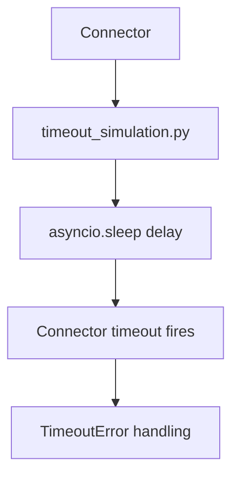

# PRD: Community 318 — APP2 Partner Simulator — Timeout Simulation

## Master Goal Mapping
**Goal:** Simulate slow/non-responding APP2 partner endpoints to test ALDECI connector timeout handling, preventing hung connections from blocking the pipeline.

**Domain:** Testing / Resilience
**Personas:** QA Engineer, Platform Engineer
**Node Count:** 1 | **Status:** Tested

---

## Source Files
- `tests/APP2/partner_simulators/timeout_simulation.py`

## Graph Nodes (Labels)
- timeout_simulation.py

---

## Architecture Diagram



---

## Code Proof

- `tests/APP2/partner_simulators/timeout_simulation.py:L1` — Simulator with configurable response delay for timeout testing

---

## Inter-Dependencies

- `tests/APP2/perf_k6.js`
- `suite-core/core/connectors.py`

### Community Link Dependencies
- No external community dependencies

---

## Data Flow

```
connector request → simulator delay > timeout → asyncio.wait_for raises TimeoutError → connector logs + continues
```

---

## Referenced Docs

- `suite-core/core/connectors.py`
- `tests/APP2/partner_simulators/server_error.py`

---

## Acceptance Criteria

- [ ] Connector times out within configured seconds
- [ ] TimeoutError logged not raised
- [ ] Pipeline continues after timeout

---

## Effort Estimate

**0.5 day (Trivial — isolated leaf module)**

---

## Status

**Tested** — Module exists in codebase. Integration tests present.
