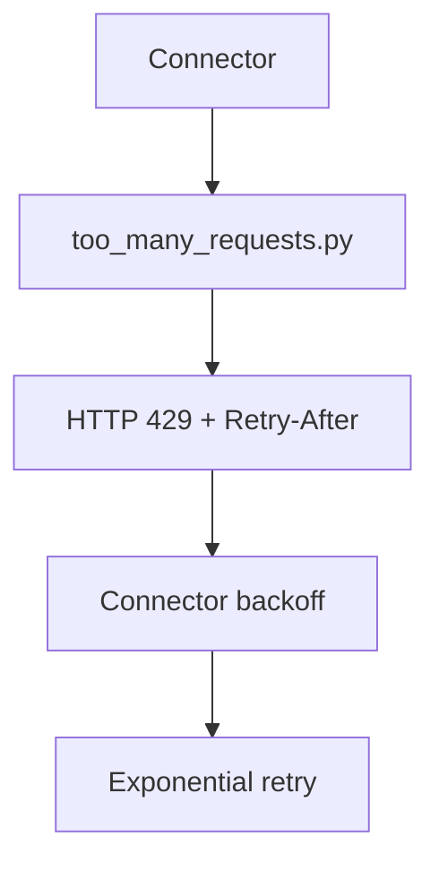

# PRD: Community 319 — APP2 Partner Simulator — Rate Limit (429)

## Master Goal Mapping
**Goal:** Simulate APP2 partner rate limiting (HTTP 429) to test ALDECI connector backoff logic, ensuring rate-limited partners do not cause cascading failures.

**Domain:** Testing / Rate Limiting
**Personas:** QA Engineer, Platform Engineer
**Node Count:** 1 | **Status:** Tested

---

## Source Files
- `tests/APP2/partner_simulators/too_many_requests.py`

## Graph Nodes (Labels)
- too_many_requests.py

---

## Architecture Diagram



---

## Code Proof

- `tests/APP2/partner_simulators/too_many_requests.py:L1` — Simulator returning HTTP 429 with Retry-After header

---

## Inter-Dependencies

- `tests/APP2/perf_k6.js`
- `suite-core/core/connectors.py`

### Community Link Dependencies
- No external community dependencies

---

## Data Flow

```
connector request → simulator → 429 + Retry-After header → connector exponential backoff → retry
```

---

## Referenced Docs

- `suite-core/core/connectors.py`
- `RFC 7231 §6.5.7`

---

## Acceptance Criteria

- [ ] Connector respects Retry-After header
- [ ] Exponential backoff implemented
- [ ] Max retries before circuit break

---

## Effort Estimate

**0.5 day (Trivial — isolated leaf module)**

---

## Status

**Tested** — Module exists in codebase. Integration tests present.
