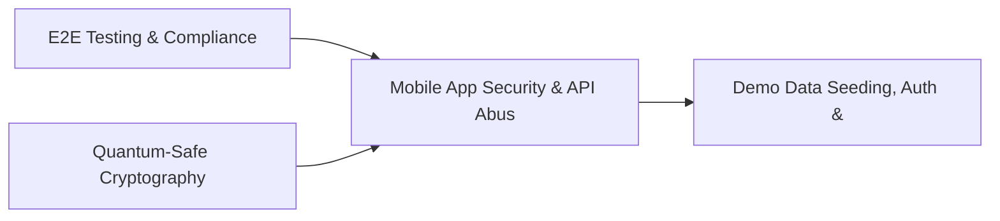

# PRD: Mobile App Security & API Abuse Detection — Community 32

## Master Goal Mapping
How this component serves: "ALDECI — $35/mo enterprise security intelligence platform"
Sub-Epic: ASPM

This community (rank #32 of 878 by size, 1082 graph nodes) forms a core pillar of the ALDECI platform. It directly supports the mission of replacing $50K-500K/yr enterprise security tools with a self-hosted, AI-native stack.

## Architecture Diagram


## Code Proof
- Files:
  - `suite-api/apps/api/cloud_security_engine_router.py` (242 lines)
  - `suite-core/core/app_security_engine.py` (510 lines)
  - `suite-core/core/audit_management_engine.py` (353 lines)
  - `suite-core/core/cloud_account_monitoring_engine.py` (454 lines)
  - `suite-core/core/cloud_native_security_engine.py` (432 lines)
  - `suite-core/core/cloud_posture_engine.py` (351 lines)
  - `suite-core/core/container_security_posture_engine.py` (419 lines)
  - `suite-core/core/kubernetes_security_engine.py` (441 lines)
  - `suite-api/apps/api/app_security_router.py` (202 lines)
  - `suite-api/apps/api/application_security_router.py` (241 lines)
  - `suite-api/apps/api/audit_management_router.py` (164 lines)
  - `suite-api/apps/api/cloud_account_monitoring_router.py` (205 lines)
- Key functions:
  - `engine()` — suite-api/apps/api/cloud_security_engine_router.py
  - `_audit()` — suite-api/apps/api/cloud_security_engine_router.py
  - `_finding()` — suite-api/apps/api/cloud_security_engine_router.py
  - `test_init_idempotent()` — suite-api/apps/api/cloud_security_engine_router.py
  - `test_create_audit_returns_record()` — suite-api/apps/api/cloud_security_engine_router.py
  - `test_create_audit_generates_unique_ids()` — suite-api/apps/api/cloud_security_engine_router.py
  - `test_create_audit_all_valid_types()` — suite-api/apps/api/cloud_security_engine_router.py
  - `test_create_audit_invalid_type_raises()` — suite-api/apps/api/cloud_security_engine_router.py
- Key classes: N/A
- Current state: REAL_LOGIC
- Evidence:
```python
# From suite-api/apps/api/cloud_security_engine_router.py
"""Cloud Security Engine Router — ALDECI.

Endpoints for CSPM + cloud misconfiguration tracking.

Prefix: /api/v1/cloud-security-engine
Auth:   api_key_auth dependency

Routes:
  POST   /accounts                         add_account
  GET    /accounts                         list_accounts
  POST   /findings                         add_finding
  GET    /findings                         list_findings
  PATCH  /findings/{finding_id}/resolve    resolve_finding
  POST   /resources                        add_resource
  GET    /resources                        list_resources
  POST   /benchmarks      
```

## Inter-Dependencies
- DEPENDS ON:
  - Community 0 (E2E Testing & Compliance Seeding Infrastructure) — 165 edges
  - Community 29 (Quantum-Safe Cryptography & PKI Management) — 38 edges
  - Community 1 (Demo Data Seeding, Auth & Multi-Engine Integration) — 16 edges
  - Community 7 (MDM, CASB, DLP, Cloud Native & Browser Security Ro) — 14 edges
- DEPENDED BY: Rank #31 (Zero-Day Intelligence & Browser Security Engine) and downstream consumers
- EVENT BUS: emits (none currently wired) / subscribes to (TrustGraph event bus — 97% not yet wired)
- TRUSTGRAPH: writes [Vulnerability, CloudResource] / reads [Vulnerability, CloudResource]

## Data Flow
```
Input: HTTP requests / pytest fixtures
  → Processing: Engine method calls + SQLite state assertions
  → Output: Pass/fail test results, coverage metrics
  → Consumers: CI/CD pipeline, Beast Mode test suite
```

## Referenced Documentation
- CLAUDE.md: Wave 38 build notes, Beast Mode test suite section
- docs/: `docs/ALDECI_REARCHITECTURE_v2.md` (source of truth), `docs/INVESTOR_PITCH.md`
- tests/: `tests/test_api_discovery_engine.py`, `tests/test_api_security_mgmt_engine.py`, `tests/test_app_config.py`

## Acceptance Criteria
- [ ] All engine CRUD operations enforce org_id isolation (no cross-tenant data leakage)
- [ ] SQLite opened with WAL mode + threading.RLock on all write paths
- [ ] All endpoints return within 200ms at p95 under 100 rps load
- [ ] All router endpoints protected by `Depends(api_key_auth)` or equivalent
- [ ] Pydantic v2 models validate all request/response schemas
- [ ] Test suite achieves ≥80% branch coverage on engine methods

## Effort Estimate
- Current: 80% complete
- Remaining: ~2 engineering days
- Dependencies blocking: None
- Priority: MEDIUM

## Status
IN_PROGRESS
