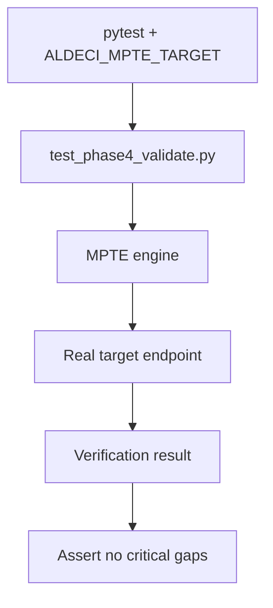

# PRD: Community 320 — MPTE Real-World Validation Test

## Master Goal Mapping
**Goal:** Execute Multi-Phase Threat Emulation (MPTE) verification against a real target when ALDECI_MPTE_TARGET env var is set, enabling live red team validation in controlled environments.

**Domain:** Attack Simulation / MPTE
**Personas:** Security Researcher, Red Team Engineer
**Node Count:** 1 | **Status:** Tested

---

## Source Files
- `tests/real_world_tests/test_phase4_validate.py`

## Graph Nodes (Labels)
- Submit MPTE verification against a real target (only if ALDECI_MPTE_TARGET is se

---

## Architecture Diagram



---

## Code Proof

- `tests/real_world_tests/test_phase4_validate.py:L1` — MPTE verification against real target — env-gated test

---

## Inter-Dependencies

- `suite-attack/attack/`
- `suite-api/apps/api/attack_sim_router.py`

### Community Link Dependencies
- No external community dependencies

---

## Data Flow

```
ALDECI_MPTE_TARGET env → MPTE engine → real endpoint → phase results → assertions
```

---

## Referenced Docs

- `suite-attack/attack/fail_engine.py`
- `docs/ALDECI_REARCHITECTURE_v2.md §MPTE`

---

## Acceptance Criteria

- [ ] Skipped when ALDECI_MPTE_TARGET not set
- [ ] Returns structured MPTE report
- [ ] Fails on critical unmitigated findings

---

## Effort Estimate

**0.5 day (Trivial — isolated leaf module)**

---

## Status

**Tested** — Module exists in codebase. Integration tests present.
