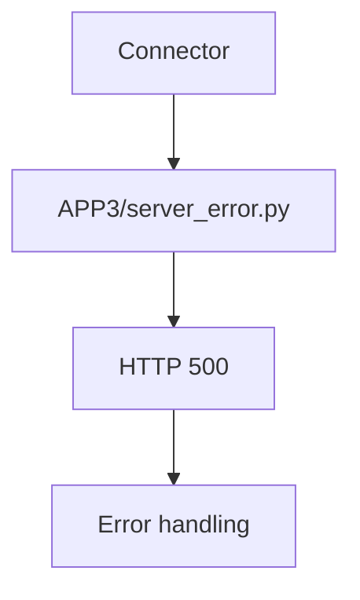

# PRD: Community 322 — APP3 Partner Simulator — Server Error

## Master Goal Mapping
**Goal:** Simulate 5xx responses from APP3 partner to test ALDECI resilience for the third integration partner, ensuring error handling is partner-agnostic.

**Domain:** Testing / Partner Simulation
**Personas:** QA Engineer
**Node Count:** 1 | **Status:** Tested

---

## Source Files
- `tests/APP3/partner_simulators/server_error.py`

## Graph Nodes (Labels)
- server_error.py

---

## Architecture Diagram



---

## Code Proof

- `tests/APP3/partner_simulators/server_error.py:L1` — APP3 500 error simulator

---

## Inter-Dependencies

- `tests/APP3/perf_k6.js`
- `suite-core/core/connectors.py`

### Community Link Dependencies
- No external community dependencies

---

## Data Flow

```
connector → APP3 simulator → 500 → retry/error log
```

---

## Referenced Docs

- `tests/APP2/partner_simulators/server_error.py`

---

## Acceptance Criteria

- [ ] 500 returned consistently
- [ ] Connector error metrics incremented
- [ ] Incident not created for connector errors

---

## Effort Estimate

**0.5 day (Trivial — isolated leaf module)**

---

## Status

**Tested** — Module exists in codebase. Integration tests present.
