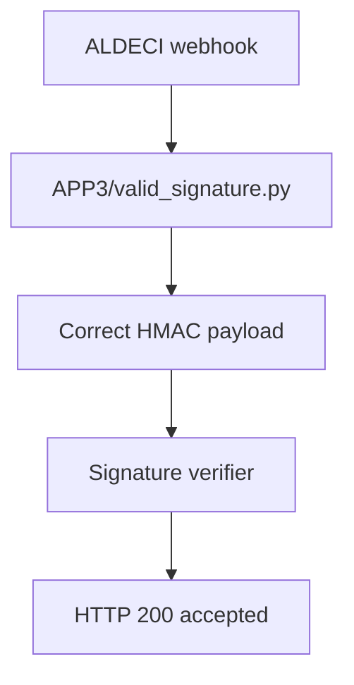

# PRD: Community 323 — APP3 Partner Simulator — Valid Signature

## Master Goal Mapping
**Goal:** Provide APP3 partner webhook payloads with correct HMAC signatures, serving as positive test baseline for ALDECI signature verification.

**Domain:** Testing / Webhook Validation
**Personas:** QA Engineer
**Node Count:** 1 | **Status:** Tested

---

## Source Files
- `tests/APP3/partner_simulators/valid_signature.py`

## Graph Nodes (Labels)
- valid_signature.py

---

## Architecture Diagram



---

## Code Proof

- `tests/APP3/partner_simulators/valid_signature.py:L1` — APP3 valid HMAC signature simulator — positive test case

---

## Inter-Dependencies

- `suite-core/core/connectors.py`
- `tests/APP3/partner_simulators/invalid_signature.py`

### Community Link Dependencies
- No external community dependencies

---

## Data Flow

```
simulator → POST webhook with valid_sig → ALDECI → HMAC verified → event processed
```

---

## Referenced Docs

- `tests/APP2/partner_simulators/`
- `suite-core/core/connectors.py`

---

## Acceptance Criteria

- [ ] Valid signature accepted (200)
- [ ] Event processed into pipeline
- [ ] Paired with invalid_signature test

---

## Effort Estimate

**0.5 day (Trivial — isolated leaf module)**

---

## Status

**Tested** — Module exists in codebase. Integration tests present.
