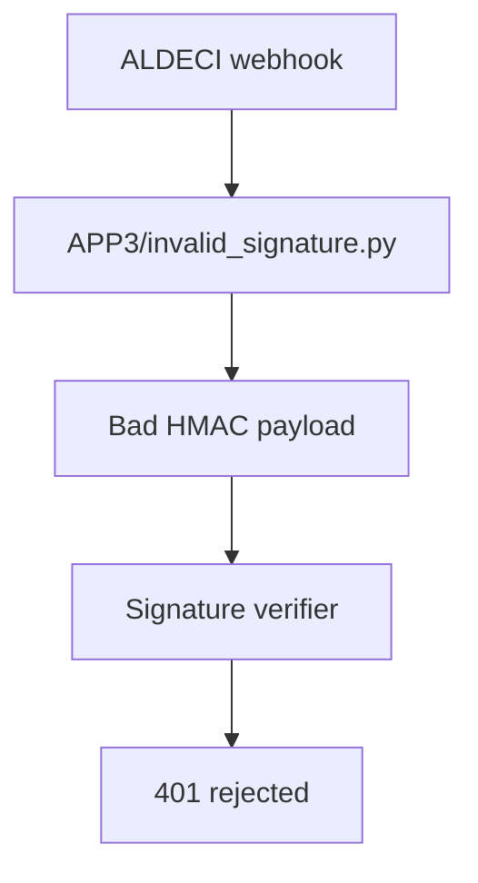

# PRD: Community 324 — APP3 Partner Simulator — Invalid Signature

## Master Goal Mapping
**Goal:** Simulate APP3 partner webhook payloads with invalid HMAC signatures to ensure ALDECI rejects tampered partner payloads across all integration partners.

**Domain:** Testing / Security
**Personas:** QA Engineer, Security Engineer
**Node Count:** 1 | **Status:** Tested

---

## Source Files
- `tests/APP3/partner_simulators/invalid_signature.py`

## Graph Nodes (Labels)
- invalid_signature.py

---

## Architecture Diagram



---

## Code Proof

- `tests/APP3/partner_simulators/invalid_signature.py:L1` — APP3 invalid signature simulator

---

## Inter-Dependencies

- `tests/APP3/partner_simulators/valid_signature.py`
- `suite-core/core/connectors.py`

### Community Link Dependencies
- No external community dependencies

---

## Data Flow

```
simulator → bad_sig POST → ALDECI HMAC check → fail → 401 + security log
```

---

## Referenced Docs

- `tests/APP2/partner_simulators/invalid_signature.py`

---

## Acceptance Criteria

- [ ] Rejected with 401
- [ ] Security event logged
- [ ] Consistent with APP2 behavior

---

## Effort Estimate

**0.5 day (Trivial — isolated leaf module)**

---

## Status

**Tested** — Module exists in codebase. Integration tests present.
