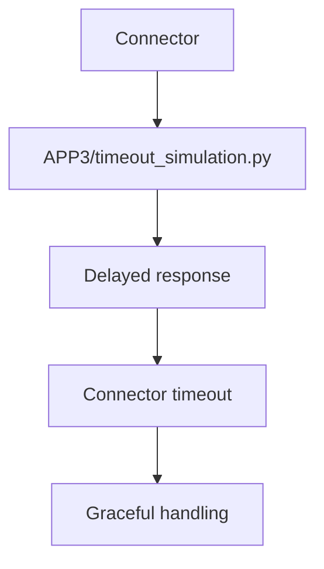

# PRD: Community 325 — APP3 Partner Simulator — Timeout

## Master Goal Mapping
**Goal:** Simulate APP3 partner slow responses to validate timeout handling consistency across all ALDECI integration partners.

**Domain:** Testing / Resilience
**Personas:** QA Engineer, Platform Engineer
**Node Count:** 1 | **Status:** Tested

---

## Source Files
- `tests/APP3/partner_simulators/timeout_simulation.py`

## Graph Nodes (Labels)
- timeout_simulation.py

---

## Architecture Diagram



---

## Code Proof

- `tests/APP3/partner_simulators/timeout_simulation.py:L1` — APP3 timeout simulator

---

## Inter-Dependencies

- `tests/APP3/perf_k6.js`
- `suite-core/core/connectors.py`

### Community Link Dependencies
- No external community dependencies

---

## Data Flow

```
connector → APP3 delayed response → timeout → error log + continue
```

---

## Referenced Docs

- `tests/APP2/partner_simulators/timeout_simulation.py`

---

## Acceptance Criteria

- [ ] Timeout within configured threshold
- [ ] No hung connections
- [ ] Metrics include timeout count

---

## Effort Estimate

**0.5 day (Trivial — isolated leaf module)**

---

## Status

**Tested** — Module exists in codebase. Integration tests present.
