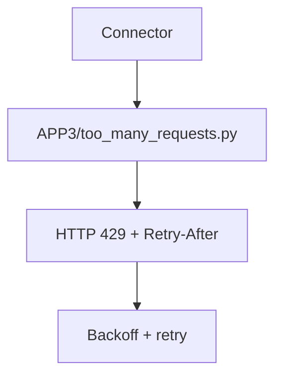

# PRD: Community 326 — APP3 Partner Simulator — Rate Limit (429)

## Master Goal Mapping
**Goal:** Simulate APP3 partner rate limiting to ensure ALDECI connector backoff logic works consistently across all partner integrations.

**Domain:** Testing / Rate Limiting
**Personas:** QA Engineer
**Node Count:** 1 | **Status:** Tested

---

## Source Files
- `tests/APP3/partner_simulators/too_many_requests.py`

## Graph Nodes (Labels)
- too_many_requests.py

---

## Architecture Diagram



---

## Code Proof

- `tests/APP3/partner_simulators/too_many_requests.py:L1` — APP3 rate limit simulator returning 429

---

## Inter-Dependencies

- `tests/APP3/perf_k6.js`
- `suite-core/core/connectors.py`

### Community Link Dependencies
- No external community dependencies

---

## Data Flow

```
connector → 429 response → Retry-After header → exponential backoff → retry
```

---

## Referenced Docs

- `tests/APP2/partner_simulators/too_many_requests.py`

---

## Acceptance Criteria

- [ ] 429 returned with Retry-After
- [ ] Connector backs off
- [ ] Consistent with APP2 behavior

---

## Effort Estimate

**0.5 day (Trivial — isolated leaf module)**

---

## Status

**Tested** — Module exists in codebase. Integration tests present.
