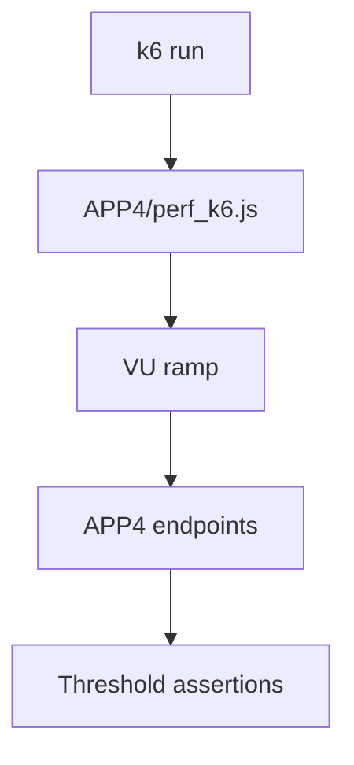

# PRD: Community 327 — APP4 k6 Performance Load Test

## Master Goal Mapping
**Goal:** Execute k6 load tests against APP4 integration to validate ALDECI handles high-volume fourth-party connector traffic within SLA thresholds.

**Domain:** Performance Testing
**Personas:** Platform Engineer, QA Engineer
**Node Count:** 1 | **Status:** Tested

---

## Source Files
- `tests/APP4/perf_k6.js`

## Graph Nodes (Labels)
- perf_k6.js

---

## Architecture Diagram



---

## Code Proof

- `tests/APP4/perf_k6.js:L1` — k6 performance test for APP4 integration

---

## Inter-Dependencies

- `k6 binary`
- `tests/APP4/`

### Community Link Dependencies
- No external community dependencies

---

## Data Flow

```
k6 VUs → APP4 requests → p95/error metrics → threshold pass/fail
```

---

## Referenced Docs

- `tests/APP2/perf_k6.js`
- `tests/APP3/perf_k6.js`

---

## Acceptance Criteria

- [ ] p95 < 500ms at 50 VUs
- [ ] Error rate < 1%
- [ ] Output k6 JSON summary

---

## Effort Estimate

**0.5 day (Trivial — isolated leaf module)**

---

## Status

**Tested** — Module exists in codebase. Integration tests present.
