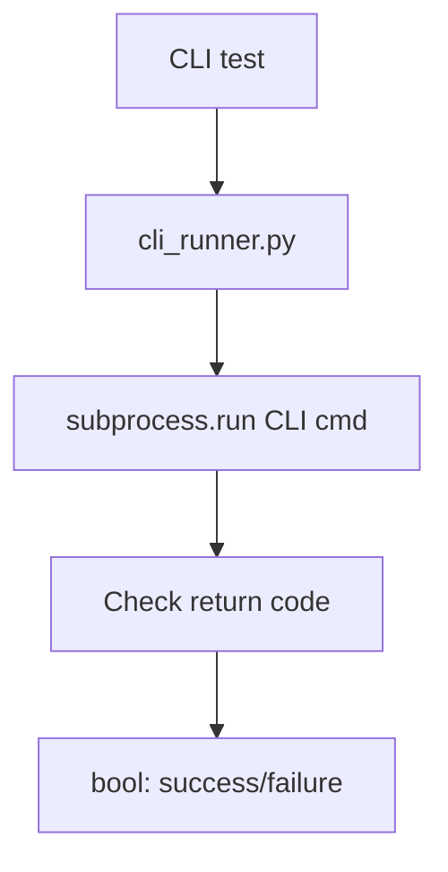

# PRD: Community 328 — CLI Runner Success Checker

## Master Goal Mapping
**Goal:** Provide a reusable utility for test harness to check whether CLI command executions succeeded, enabling clean assertion patterns across CLI integration tests.

**Domain:** Testing Harness / CLI
**Personas:** QA Engineer, Platform Engineer
**Node Count:** 1 | **Status:** Tested

---

## Source Files
- `tests/harness/cli_runner.py`

## Graph Nodes (Labels)
- Check if CLI execution was successful.

---

## Architecture Diagram



---

## Code Proof

- `tests/harness/cli_runner.py:L1` — Check if CLI execution was successful — harness utility

---

## Inter-Dependencies

- `tests/harness/`
- `suite-core/core/`

### Community Link Dependencies
- No external community dependencies

---

## Data Flow

```
CLI command → subprocess.run() → returncode == 0 → bool result
```

---

## Referenced Docs

- `tests/harness/server_manager.py`
- `suite-core/core/brain_pipeline.py`

---

## Acceptance Criteria

- [ ] Returns True on exit code 0
- [ ] Returns False on non-zero exit
- [ ] Captures stdout/stderr for debugging

---

## Effort Estimate

**0.5 day (Trivial — isolated leaf module)**

---

## Status

**Tested** — Module exists in codebase. Integration tests present.
