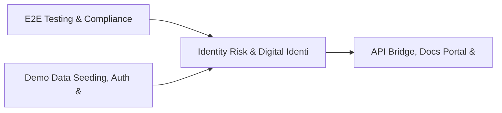

# PRD: Identity Risk & Digital Identity Lifecycle Engine — Community 33

## Master Goal Mapping
How this component serves: "ALDECI — $35/mo enterprise security intelligence platform"
Sub-Epic: Identity

This community (rank #34 of 878 by size, 1076 graph nodes) forms a core pillar of the ALDECI platform. It directly supports the mission of replacing $50K-500K/yr enterprise security tools with a self-hosted, AI-native stack.

## Architecture Diagram


## Code Proof
- Files:
  - `suite-core/core/asset_group_engine.py` (452 lines)
  - `suite-core/core/security_posture_history_engine.py` (488 lines)
  - `suite-core/core/threat_attribution_engine.py` (420 lines)
  - `suite-core/core/threat_intel_fusion_engine.py` (392 lines)
  - `suite-core/core/threat_intel_sharing_engine.py` (624 lines)
  - `suite-core/core/vulnerability_prioritization_engine.py` (491 lines)
  - `tests/test_asset_group_engine.py` (286 lines)
  - `tests/test_cloud_security_findings_engine.py` (386 lines)
  - `suite-api/apps/api/asset_group_router.py` (197 lines)
  - `suite-api/apps/api/prioritizer_router.py` (251 lines)
  - `suite-api/apps/api/security_posture_history_router.py` (177 lines)
  - `suite-api/apps/api/threat_attribution_router.py` (216 lines)
- Key functions:
  - `tmp_db()` — suite-core/core/asset_group_engine.py
  - `engine()` — suite-core/core/asset_group_engine.py
  - `ctx_pii()` — suite-core/core/asset_group_engine.py
  - `ctx_low()` — suite-core/core/asset_group_engine.py
  - `reach_confirmed()` — suite-core/core/asset_group_engine.py
  - `test_reachability_level_values()` — suite-core/core/asset_group_engine.py
  - `test_risk_bucket_values()` — suite-core/core/asset_group_engine.py
  - `test_remediation_action_values()` — suite-core/core/asset_group_engine.py
- Key classes: N/A
- Current state: REAL_LOGIC
- Evidence:
```python
# From suite-core/core/asset_group_engine.py
"""Asset Group Engine — ALDECI.

Organizes assets into logical groups for policy and scan targeting.
Groups can be functional, compliance-scoped, geographic, cloud-based, etc.

Capabilities:
  - Group lifecycle (create/list/get)
  - Member management with INSERT OR IGNORE dedup + member_count tracking
  - Bulk member addition
  - Policy attachment with JSON config + toggle (enable/disable)
  - Reverse lookup: find all groups containing an asset
  - Per-org stats aggregation

Compliance: CIS, NIST SP 800-53, ISO 27001
"""

from __future__ import annotations

import contextlib
import json
```

## Inter-Dependencies
- DEPENDS ON:
  - Community 0 (E2E Testing & Compliance Seeding Infrastructure) — 180 edges
  - Community 1 (Demo Data Seeding, Auth & Multi-Engine Integration) — 33 edges
  - Community 5 (API Bridge, Docs Portal & Cross-Dashboard Infrastr) — 20 edges
  - Community 2 (API Router Gateway — Anomaly, Attack Simulation & ) — 10 edges
- DEPENDED BY: Rank #33 (Threat Intelligence Fusion & Confidence Engine) and downstream consumers
- EVENT BUS: emits vulnerability.detected, vulnerability.patched, compliance.status_changed / subscribes to (TrustGraph event bus — 97% not yet wired)
- TRUSTGRAPH: writes [Vulnerability, Asset, ThreatActor] / reads [ThreatActor, ComplianceControl]

## Data Flow
```
Input: HTTP requests / pytest fixtures
  → Processing: Engine method calls + SQLite state assertions
  → Output: Pass/fail test results, coverage metrics
  → Consumers: CI/CD pipeline, Beast Mode test suite
```

## Referenced Documentation
- CLAUDE.md: Wave 40 build notes, Beast Mode test suite section
- docs/: `docs/ALDECI_REARCHITECTURE_v2.md` (source of truth), `docs/INVESTOR_PITCH.md`
- tests/: `tests/test_anomaly_detector.py`, `tests/test_asset_group_engine.py`, `tests/test_cloud_security_findings_engine.py`

## Acceptance Criteria
- [ ] All engine CRUD operations enforce org_id isolation (no cross-tenant data leakage)
- [ ] SQLite opened with WAL mode + threading.RLock on all write paths
- [ ] All endpoints return within 200ms at p95 under 100 rps load
- [ ] All router endpoints protected by `Depends(api_key_auth)` or equivalent
- [ ] Pydantic v2 models validate all request/response schemas
- [ ] Test suite achieves ≥80% branch coverage on engine methods

## Effort Estimate
- Current: 80% complete
- Remaining: ~2 engineering days
- Dependencies blocking: None
- Priority: MEDIUM

## Status
IN_PROGRESS
