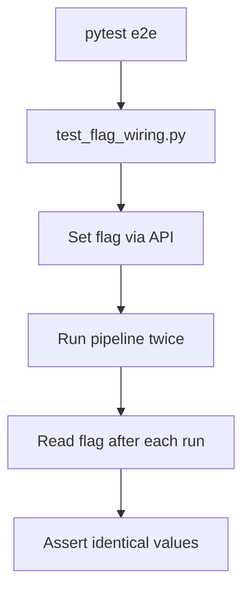

# PRD: Community 335 — E2E Flag Wiring Persistence Test

## Master Goal Mapping
**Goal:** Assert that feature flag values persist correctly across multiple ALDECI pipeline runs, preventing flag drift that could cause intermittent security control failures.

**Domain:** E2E Testing / Feature Flags
**Personas:** Platform Engineer, QA Engineer
**Node Count:** 1 | **Status:** Tested

---

## Source Files
- `tests/e2e/test_flag_wiring.py`

## Graph Nodes (Labels)
- Test that flag values persist correctly across multiple pipeline runs.

---

## Architecture Diagram



---

## Code Proof

- `tests/e2e/test_flag_wiring.py:L1` — Test that flag values persist correctly across multiple pipeline runs

---

## Inter-Dependencies

- `suite-api/apps/main.py`
- `suite-core/core/brain_pipeline.py`

### Community Link Dependencies
- No external community dependencies

---

## Data Flow

```
set flag → pipeline run 1 → assert flag → pipeline run 2 → assert flag unchanged
```

---

## Referenced Docs

- `suite-core/core/brain_pipeline.py`
- `tests/test_pipeline_api.py`

---

## Acceptance Criteria

- [ ] Flag value identical after 2 pipeline runs
- [ ] Persistence across server restarts
- [ ] Default values correct on first boot

---

## Effort Estimate

**0.5 day (Trivial — isolated leaf module)**

---

## Status

**Tested** — Module exists in codebase. Integration tests present.
