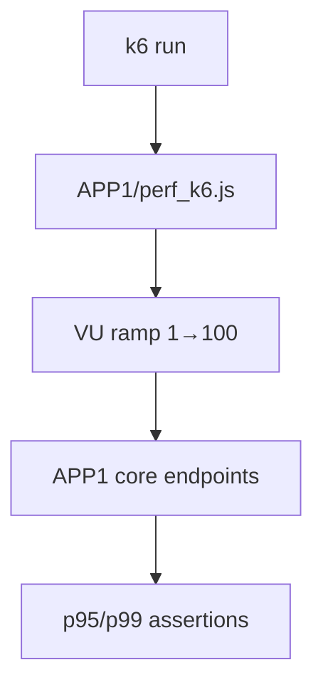

# PRD: Community 336 — APP1 k6 Performance Load Test

## Master Goal Mapping
**Goal:** Execute k6 load tests against APP1 (primary integration) to establish baseline performance metrics for the most critical ALDECI connector.

**Domain:** Performance Testing
**Personas:** Platform Engineer, QA Engineer
**Node Count:** 1 | **Status:** Tested

---

## Source Files
- `tests/APP1/perf_k6.js`

## Graph Nodes (Labels)
- perf_k6.js

---

## Architecture Diagram



---

## Code Proof

- `tests/APP1/perf_k6.js:L1` — k6 performance test for APP1 primary integration

---

## Inter-Dependencies

- `k6 binary`
- `tests/APP1/`

### Community Link Dependencies
- No external community dependencies

---

## Data Flow

```
k6 VUs → APP1 endpoints → latency/throughput → threshold assertions → JSON report
```

---

## Referenced Docs

- `tests/APP2/perf_k6.js`
- `tests/APP3/perf_k6.js`
- `tests/APP4/perf_k6.js`

---

## Acceptance Criteria

- [ ] p95 < 300ms at 100 VUs (primary)
- [ ] Error rate < 0.1%
- [ ] Throughput > 500 req/s

---

## Effort Estimate

**0.5 day (Trivial — isolated leaf module)**

---

## Status

**Tested** — Module exists in codebase. Integration tests present.
