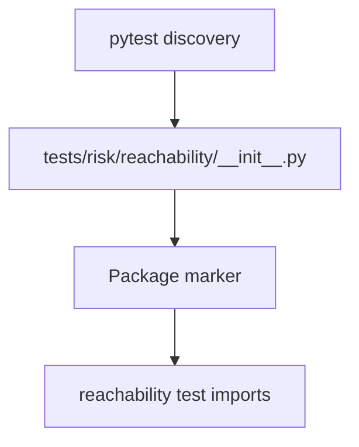

# PRD: Community 337 — Risk Reachability Test Package Init

## Master Goal Mapping
**Goal:** Mark the tests/risk/reachability/ directory as a Python package, enabling the reachability analysis test module to be imported and discovered by pytest.

**Domain:** Testing Infrastructure
**Personas:** Platform Engineer
**Node Count:** 1 | **Status:** Tested

---

## Source Files
- `tests/risk/reachability/__init__.py`

## Graph Nodes (Labels)
- __init__.py

---

## Architecture Diagram



---

## Code Proof

- `tests/risk/reachability/__init__.py:L1` — Package init for reachability test module

---

## Inter-Dependencies

- `tests/risk/`
- `pytest`

### Community Link Dependencies
- No external community dependencies

---

## Data Flow

```
pytest → package scan → __init__.py → reachability test discovery
```

---

## Referenced Docs

- `tests/test_phase4_integration.py`

---

## Acceptance Criteria

- [ ] pytest discovers reachability tests
- [ ] No import errors
- [ ] Package namespace clean

---

## Effort Estimate

**0.5 day (Trivial — isolated leaf module)**

---

## Status

**Tested** — Module exists in codebase. Integration tests present.
