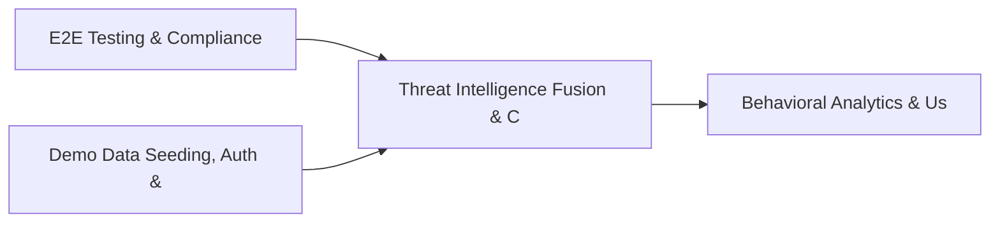

# PRD: Threat Intelligence Fusion & Confidence Engine — Community 34

## Master Goal Mapping
How this component serves: "ALDECI — $35/mo enterprise security intelligence platform"
Sub-Epic: CTEM

This community (rank #33 of 878 by size, 1076 graph nodes) forms a core pillar of the ALDECI platform. It directly supports the mission of replacing $50K-500K/yr enterprise security tools with a self-hosted, AI-native stack.

## Architecture Diagram


## Code Proof
- Files:
  - `suite-core/core/breach_detection_engine.py` (481 lines)
  - `suite-core/core/insider_threat_engine.py` (584 lines)
  - `suite-core/core/network_monitoring_engine.py` (414 lines)
  - `suite-core/core/privilege_escalation_detector_engine.py` (551 lines)
  - `suite-core/core/privileged_identity_engine.py` (524 lines)
  - `suite-core/core/security_operations_metrics_engine.py` (412 lines)
  - `suite-core/core/siem_integration_engine.py` (970 lines)
  - `suite-core/core/vuln_workflow_engine.py` (817 lines)
  - `suite-api/apps/api/alert_triage_router.py` (201 lines)
  - `suite-api/apps/api/alerting_notification_router.py` (198 lines)
  - `suite-api/apps/api/breach_detection_router.py` (177 lines)
  - `suite-api/apps/api/insider_threat_router.py` (292 lines)
- Key functions:
  - `engine()` — suite-core/core/breach_detection_engine.py
  - `test_init_creates_db()` — suite-core/core/breach_detection_engine.py
  - `test_init_empty_stats()` — suite-core/core/breach_detection_engine.py
  - `test_register_siem_source_returns_record()` — suite-core/core/breach_detection_engine.py
  - `test_register_siem_source_all_valid_types()` — suite-core/core/breach_detection_engine.py
  - `test_register_siem_source_invalid_type_raises()` — suite-core/core/breach_detection_engine.py
  - `test_register_siem_source_missing_name_raises()` — suite-core/core/breach_detection_engine.py
  - `test_register_siem_source_with_host_port()` — suite-core/core/breach_detection_engine.py
- Key classes: N/A
- Current state: REAL_LOGIC
- Evidence:
```python
# From suite-core/core/breach_detection_engine.py
"""
BreachDetectionEngine — ALDECI.

Tracks detection rules (behavioral/signature/anomaly/heuristic/ml_based) and
detection events with full lifecycle: open → investigating → closed.

SQLite-backed, thread-safe, multi-tenant (per org_id).

Compliance: SOC2 CC7.2, NIST SP 800-53 IR-4 (incident handling), SI-4 (monitoring).
"""

from __future__ import annotations

import json
import logging
import sqlite3
import threading
import uuid
from datetime import datetime, timezone
from pathlib import Path
```

## Inter-Dependencies
- DEPENDS ON:
  - Community 0 (E2E Testing & Compliance Seeding Infrastructure) — 179 edges
  - Community 1 (Demo Data Seeding, Auth & Multi-Engine Integration) — 22 edges
  - Community 23 (Behavioral Analytics & User Risk Profiling) — 9 edges
  - Community 40 (Network Forensics & Malware Analysis Engine) — 9 edges
- DEPENDED BY: Rank #32 (Mobile App Security & API Abuse Detection) and downstream consumers
- EVENT BUS: emits alert.created, alert.resolved / subscribes to (TrustGraph event bus — 97% not yet wired)
- TRUSTGRAPH: writes [Vulnerability, ThreatActor, Alert] / reads [Alert, Identity]

## Data Flow
```
Input: HTTP requests / pytest fixtures
  → Processing: Engine method calls + SQLite state assertions
  → Output: Pass/fail test results, coverage metrics
  → Consumers: CI/CD pipeline, Beast Mode test suite
```

## Referenced Documentation
- CLAUDE.md: Wave 39 build notes, Beast Mode test suite section
- docs/: `docs/ALDECI_REARCHITECTURE_v2.md` (source of truth), `docs/INVESTOR_PITCH.md`
- tests/: `suite-core/telemetry_bridge/aws_lambda/test_handler.py`, `suite-core/telemetry_bridge/azure_function/test_function.py`, `suite-core/telemetry_bridge/gcp_function/test_main.py`

## Acceptance Criteria
- [ ] All engine CRUD operations enforce org_id isolation (no cross-tenant data leakage)
- [ ] SQLite opened with WAL mode + threading.RLock on all write paths
- [ ] All endpoints return within 200ms at p95 under 100 rps load
- [ ] All router endpoints protected by `Depends(api_key_auth)` or equivalent
- [ ] Pydantic v2 models validate all request/response schemas
- [ ] Test suite achieves ≥80% branch coverage on engine methods

## Effort Estimate
- Current: 80% complete
- Remaining: ~2 engineering days
- Dependencies blocking: None
- Priority: MEDIUM

## Status
IN_PROGRESS
