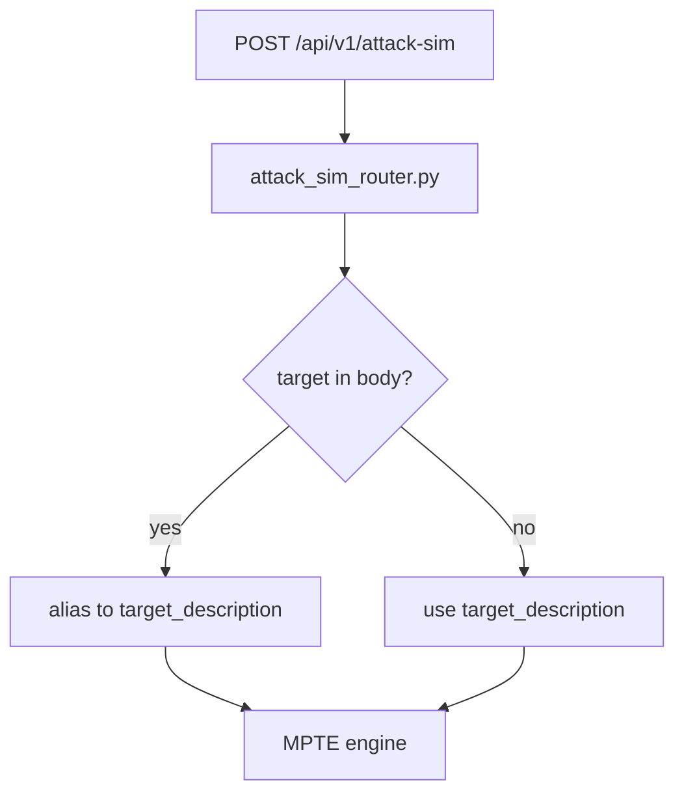

# PRD: Community 346 — Attack Sim Router — Target Alias Normalization

## Master Goal Mapping
**Goal:** Accept "target" as an API alias for "target_description" in attack simulation requests, ensuring backward compatibility with clients using the older field name.

**Domain:** API Compatibility / Attack Simulation
**Personas:** Red Team Engineer, Platform Engineer
**Node Count:** 1 | **Status:** Implemented

---

## Source Files
- `suite-attack/api/attack_sim_router.py`

## Graph Nodes (Labels)
- Accept 'target' as alias for 'target_description'.

---

## Architecture Diagram



---

## Code Proof

- `suite-attack/api/attack_sim_router.py:L1` — Accept 'target' as alias for 'target_description' — backward compat

---

## Inter-Dependencies

- `suite-attack/attack/`
- `suite-api/apps/main.py`

### Community Link Dependencies
- No external community dependencies

---

## Data Flow

```
request body → check 'target' key → rename to 'target_description' → engine call
```

---

## Referenced Docs

- `suite-attack/api/attack_sim_router.py`
- `suite-attack/attack/fail_engine.py`

---

## Acceptance Criteria

- [ ] 'target' field accepted identically to 'target_description'
- [ ] Both fields cannot conflict
- [ ] Old clients continue to work

---

## Effort Estimate

**0.5 day (Trivial — isolated leaf module)**

---

## Status

**Implemented** — Module exists in codebase. Integration tests recommended.
